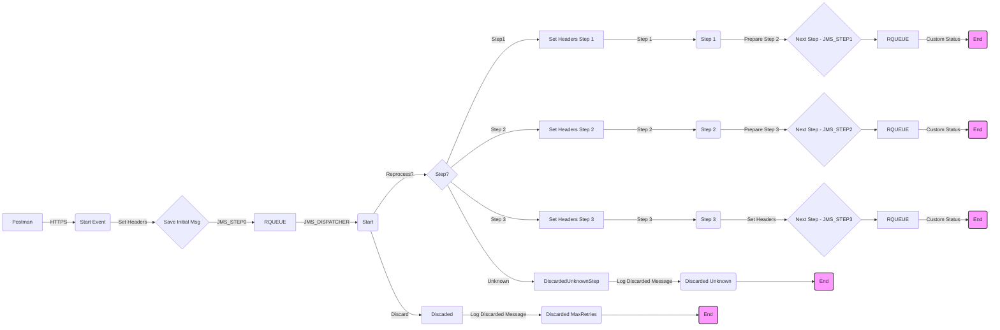

**iFlowId**: SEDA_Model_-_Single_Queue_-_Restart_and_Discard - **iFlowVersion**: 1.0.0

**Functional Summary**

- **Brief description of the iFlow**

This iFlow implements a SEDA (Staged Event-Driven Architecture) pattern with a single JMS queue. It receives messages, processes them in a series of steps (Step 1, Step 2, Step 3), and then either sends the message to another JMS queue for the next step or discards it if processing fails after a certain number of retries. The iFlow handles exceptions, logs discarded messages, and sets custom statuses for monitoring. It includes retry and discard mechanisms for error handling and ensures messages are processed in order.

- **Involved systems**

*   SQUEUE (Source Queue)
*   RQUEUE (Receiver Queue)
*   Postman (HTTP Client)

- **Used Adapters**

*   JMS
*   HTTPS

- **Key steps**

1.  Receive message from SQUEUE via JMS adapter.
2.  Determine which step is next via the content enricher and gateway.
3.  Process Step 1 (Process_36).
4.  Process Step 2 (Process_40).
5.  Process Step 3 (Process_44).
6.  If step is Step1, Step 2 or Step 3, Set Headers, send message to RQUEUE via JMS Adapter.
7.  If message processing fails and exceeds the `MaxRetries`, discard the message.
8. Log Async Exceptions in all steps using a local integration process.

- **Message transformation**

*   The iFlow uses content enrichers to set headers and properties at various stages.
*   Groovy scripts are used to log discarded messages and exceptions.
*   The header `SAPJMSRetries` is used to track the number of retries.
* Prepare steps contains content enrichers with message bodies and header.

- **Externalized parameters list and their descriptions**

*   `SEDA_MAIN_QUEUE`: Name of the JMS queue used for message processing.
*   `Number of Concurrent Processes`: Number of concurrent processes for JMS dispatcher.
*   `Maximum Retry Interval`: Maximum retry interval.
*   `Expiration Period`: Expiration period for message retention.
*   `Retention Threshold 4 Alerting`: Retention threshold alerting.
*   `Retry Interval`: Retry interval.
*   `MaxRetries`: Maximum retries before discarding message.

- **DataStore / JMS Dependency**

Yes

**Mermaid Diagram**

