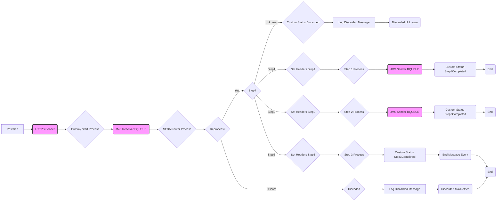

**iFlowId**: SEDA_Model_-_Single_Queue_-_Restart_and_Discard - **iFlowVersion**: 1.0.0

**Mermaid Diagram**

**Functional Summary**
- **Brief description of the iFlow**
This iFlow demonstrates a SEDA (Staged Event-Driven Architecture) model using a single JMS queue with restart and discard capabilities. It receives messages, processes them in a series of steps, and handles exceptions by logging them. It also includes logic for retries and discarding messages after a maximum number of retries. It's initiated by an HTTPs request, which sends the payload to the JMS Queue.

- **Involved systems**
    - Postman
    - SQUEUE
    - RQUEUE

- **Used Adapters**
    - JMS (Sender and Receiver)
    - HTTPS

- **Key steps**

1.  Receive message via HTTPS Adapter from Postman.
2.  "Dummy Start" process sets headers and saves the initial message to a JMS queue.
3.  The "SEDA Router" process receives the message from the JMS queue.
4.  The "SEDA Router" process checks a `Step` property to determine which step to execute. If 'Step1', 'Step2' or 'Step3', the corresponding call activity is executed. If not found the message is discarded.
5.  Each "Step" process updates a custom status in the message processing log.
6.  After completing a step, "Next Step" service task sends the message back to the JMS queue for the next step.
7.  If a step throws an exception, the `Log Async Exception` process logs the exception.
8.  The iFlow checks the `SAPJMSRetries` header. If the number of retries exceeds a configured maximum, the message is discarded.

- **Message transformation**

    -  Set headers and properties using Enrichers at multiple steps.
    -  Groovy scripts used for logging messages and exceptions.

- **Externalized parameters list and their descriptions**

    - `SEDA_MAIN_QUEUE`: Name of the JMS queue used for message exchange between steps.
    - `Number of Concurrent Processes`: Number of concurrent processes.
    - `Maximum Retry Interval`: Maximum retry interval.
    - `Retention Threshold 4 Alerting`: Alerting threshold for message retention.
    - `Expiration Period`: Message Expiration Period.
    - `Retry Interval`: JMS Retry Interval.
    - `MaxRetries`: The maximum number of retries before discarding a message.

- **DataStore / JMS Dependency**
Yes

- **Cloud Connector Dependency**
Not Found

- **Common Scripts Dependency**
Log_Exception_Async.groovy, Log_Discarded_Message.groovy and script1.groovy

- **Process Direct Dependency**
Process_44, Process_40, Process_36 and Process_12079777