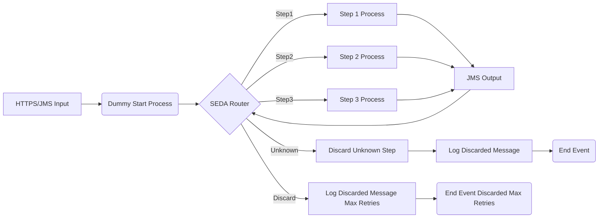

**iFlowId**: SEDA_Model_-_Single_Queue_-_Restart_and_Discard **- iFlowVersion**: 1.0.0

**Mermaid Diagram**

**Functional Summary**
- **Brief description of the iFlow**
This iFlow implements a SEDA (Staged Event-Driven Architecture) pattern with a single JMS queue. It receives messages, processes them through several steps, and sends the messages back to the same JMS queue for subsequent processing. The iFlow includes exception handling and message discarding logic based on retry counts.

- **Involved systems with Adapters Type and Endpoint Type**
    - SQUEUE: JMS, EndpointSender
    - Postman: HTTPS, EndpointSender
    - RQUEUE: JMS, EndpointReceiver

- **Key steps**
1.  Receive message via HTTPS or JMS.
2.  Set initial headers and save the initial message to the JMS Queue (RQUEUE).
3.  The SEDA Router receives message from JMS Queue (SQUEUE).
4.  The SEDA Router then routes message to Step1, Step2, and Step3 local integration processes based on the value of property Step. These steps prepare the message content and update relevant headers.
5.  After each step completion the message is send to the JMS Queue (RQUEUE).
6.  If the message fails and exceeds the maximum retry attempts, it is discarded.

- **Message transformation**
    -  Each "Step" (Step 1, Step 2, Step 3) enriches the message with a constant body.
    -  Set Headers in Dummy Start, SEDA Router, Step1, Step2, and Step3.
    -  Log Discarded Message and Log Async Exception scripts are used.

- **Externalized parameters list and their descriptions**
    - SEDA_MAIN_QUEUE: JMS queue name for the SEDA implementation.
    - Retention Threshold 4 Alerting: Threshold for alerting based on retention.
    - Expiration Period: Time after which the message expires.
    - Number of Concurrent Processes: Number of concurrent processes for JMS.
    - Maximum Retry Interval: Maximum interval for retries.
    - Retry Interval: Interval between retries.
    - MaxRetries: Max number of retries before discarding a message.

- **DataStore / JMS Dependency**
Yes

- **Cloud Connector Dependency**
Not Found

- **Common Scripts Dependency**
- Log_Discarded_Message.groovy
- Log_Exception_Async.groovy
- script1.groovy

- **ProcessDirect ComponentType Dependency**
Not Found