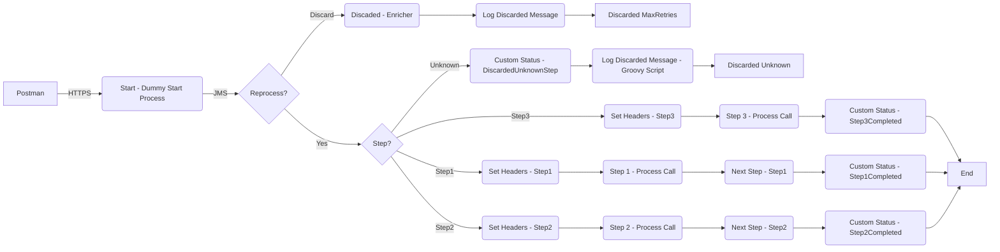

**iFlowId**: SEDA_Model_-_Single_Queue_-_Restart_and_Discard - **iFlowVersion**: 1.0.0

**Functional Summary**

- **Brief description of the iFlow**
This iFlow demonstrates a SEDA (Staged Event-Driven Architecture) pattern with a single queue. It receives messages, processes them in multiple steps and provides restart and discard capabilities based on the number of retries and the processing step. Exception handling is incorporated to log asynchronous exceptions.

- **Involved systems**
    - SQUEUE
    - RQUEUE
    - Postman

- **Used Adapters**
    - JMS (Sender and Receiver)
    - HTTPS (Sender)

- **Key steps**
    i. The iFlow is triggered by an HTTPS call from Postman that puts a message on a JMS Queue (SQUEUE).
    ii. The "Dummy Start" process receives the JMS message and saves the initial message.
    iii. The main SEDA Router process then takes over. Based on the 'Step' property of the message, it calls the appropriate step (Step 1, Step 2, or Step 3).
    iv. Each step prepares the message for the subsequent step and performs some processing.
    v. If a step fails, an error subprocess logs the exception.
    vi. If the message has been retried more than a specified number of times ('MaxRetries'), it's discarded. Otherwise, it reprocesses.

- **Message transformation**
    - The iFlow uses "Enricher" components to set headers and properties at various stages of the process, specifically to manage the message routing and logging. Steps are prepared for the next service using the "Prepare Step" Enrichers. Custom Status enrichers are also used in every Process for logging.

- **Externalized parameters list and their descriptions**
    - SEDA_MAIN_QUEUE: The name of the JMS queue used for message exchange.
    - Retention Threshold 4 Alerting: Threshold for alerting on message retention (JMS).
    - Expiration Period: Message expiration period (JMS).
    - Number of Concurrent Processes: Number of concurrent processes to execute (JMS).
    - Maximum Retry Interval: Maximum time between retry attempts (JMS).
    - Retry Interval: Time interval between retry attempts (JMS).
    - MaxRetries: The maximum number of retries before discarding a message.

- **DataStore / JMS Dependency**
Yes

**Mermaid Diagram**

