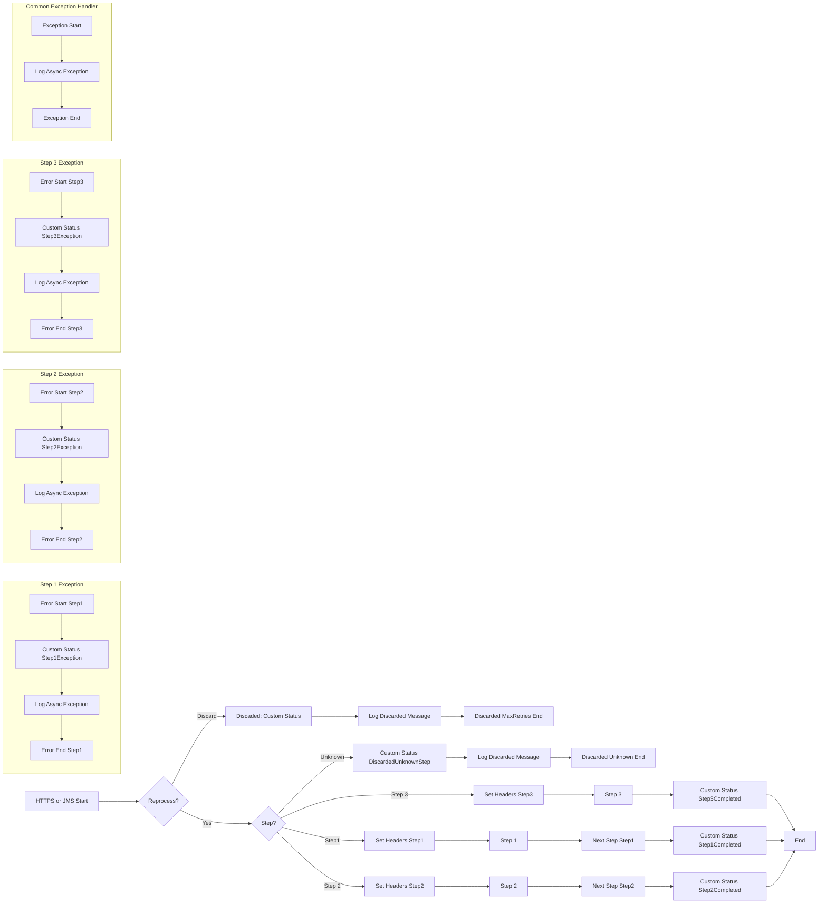

**iFlowId**: SEDA_Model_-_Single_Queue_-_Restart_and_Discard - **iFlowVersion**: 1.0.0

**Mermaid Diagram**
-   **Visual representation of the flow**

**Functional Summary**
-   **Brief description of the iFlow**

    This iFlow implements a SEDA (Staged Event-Driven Architecture) pattern using a single JMS queue. It receives messages via HTTPS or JMS, processes them in three steps, and handles exceptions by logging them and potentially discarding messages after a maximum number of retries. The iFlow can be triggered via an HTTPS endpoint or from a JMS queue. It demonstrates message processing with error handling, logging, and discard mechanisms.

-   **Involved systems**

    *   SQUEUE (JMS Sender Queue)
    *   RQUEUE (JMS Receiver Queue)
    *   Postman (HTTPS Sender)

-   **Used Adapters**

    *   JMS
    *   HTTPS

-   **Key steps**

    1.  Receive message via HTTPS or JMS.
    2.  Route to subsequent steps depending on a property (Step), which will trigger local integration processes.
    3.  Each local integration process (Step 1, Step 2, Step 3) sets up the message for the next step and calls it.
    4.  If a maximum number of retries is exceeded, the message is discarded and logged.
    5.  Exceptions are caught, logged, and custom status are created.

-   **Message transformation**

    *   The iFlow uses Enrichers to set headers and properties to control routing and processing.
    *   Uses Groovy Scripts to Log exception and discarded message.
    *   Uses Enrichers for setting SAP_MessageProcessingLogCustomStatus.
    *   Payload is wrapped into Envelope.
    *   Payload is Base64 encoded.

-   **Externalized parameters list and their descriptions**

    *   SEDA_MAIN_QUEUE: The name of the main JMS queue used for message processing.
    *   Retention Threshold 4 Alerting: Retention threshold for alerting.
    *   Expiration Period: Expiration period for messages.
    *   Number of Concurrent Processes: The number of concurrent processes to use when processing messages from the JMS queue.
    *   Maximum Retry Interval: Maximum retry interval for message processing.
    *   Retry Interval: Retry interval for message processing.
    *   MaxRetries: Maximum number of retries before discarding the message.

-   **DataStore / JMS Dependency**

    Yes

-   **Cloud Connector Dependency**

    Not Found