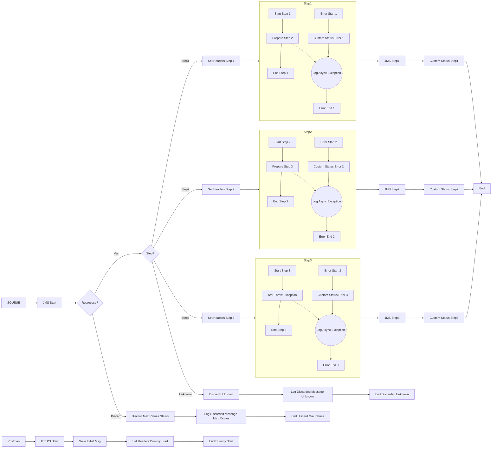

**iFlowId**: SEDA_Model_-_Single_Queue_-_Restart_and_Discard - **iFlowVersion**: 1.0.0

**Mermaid Diagram**
- **Visual representation of the flow**

**Functional Summary**
- **Brief description of the iFlow**
This iFlow implements a SEDA (Staged Event-Driven Architecture) pattern using a single JMS queue. It receives messages, processes them in multiple steps (Step 1, Step 2, Step 3), and handles exceptions by logging them and potentially discarding messages after a certain number of retries. The iFlow also logs custom status messages at various points in the flow.

- **Involved systems**
    - SQUEUE (Source Queue)
    - RQUEUE (Receiver Queue)
    - Postman (HTTP Sender)

- **Used Adapters**
    - JMS
    - HTTPS

- **Key steps**
    1.  Receive message from SQUEUE via JMS adapter.
    2.  Determine if the message needs to be reprocessed or discarded based on the number of retries.
    3.  Route the message to Step 1, Step 2, or Step 3 based on the "Step" property.
    4.  Each step (Step 1, Step 2, Step 3) prepares the message, executes its specific logic, and sets a custom status.
    5.  If an exception occurs in any step, log the exception and set a custom status. Discard the message if it fails repeatedly, log discarded messages and register corresponding custom statuses.

- **Message transformation**
    - Enricher: Used to set headers (SAP_Sender, SAP_Receiver, SAP_MessageType, SAP_MessageProcessingLogCustomStatus) and properties (Step) at various stages of the flow.
    - Groovy Scripts: Used to log exceptions and discarded messages with a custom script.

- **Externalized parameters list and their descriptions**
    - SEDA_MAIN_QUEUE: Name of the JMS queue used for asynchronous processing.
    - Number of Concurrent Processes: Number of concurrent processes used by the JMS adapter.
    - Maximum Retry Interval: Maximum retry interval for the JMS adapter.
    - Expiration Period: Expiration period for JMS messages.
    - Retention Threshold 4 Alerting: Retention threshold for JMS alerting.
    - Retry Interval: Retry interval for the JMS adapter.
    - MaxRetries: Maximum retries before discarding the message.

- **DataStore / JMS Dependency**
Yes

- **Cloud Connector Dependency**
Not Found