**iFlowId:** SEDA_Model_-_Single_Queue_-_Restart_and_Discard **iFlowVersion:** 1.0.0

**Mermaid Diagram**

```mermaid
graph LR
    Start([Start]) --> A[Main Process]

    A --> B1{Is input valid?}
    B1 -- Yes --> C[Preprocessing]
    B1 -- No --> Z[Reject Input]

    C --> D1[Subprocess A]
    D1 --> D2[Validate Data]
    D2 --> D3{Data OK?}
    D3 -- No --> Z
    D3 -- Yes --> E[Subprocess B]

    E --> F1[Transform Data]
    E --> F2[Enrich Data]
    F1 --> G[Merge Results]
    F2 --> G

    G --> H{Ready to Submit?}
    H -- Yes --> I[Submit to API]
    H -- No --> J[Wait or Retry]

    I --> K([Success ✅])
    J --> L([Manual Review 🔍])
    Z --> X([End ❌])

```

**Functional Summary**
**Brief description of the iFlow**
This iFlow implements a SEDA (Staged Event-Driven Architecture) pattern using a single JMS queue. It receives messages, processes them in multiple steps, and handles potential exceptions. The iFlow includes retry logic and discards messages that exceed the maximum retry attempts or are routed to an unknown step.

**Involved systems**
- SQUEUE (Sender Queue)
- RQUEUE (Receiver Queue)
- Postman

**Used Adapters**
- JMS (Sender and Receiver)
- HTTPS (Sender)

**Key steps**
1.  Receive message from SQUEUE via JMS.
2.  Determine the next processing step based on the `Step` property.
3.  Call the appropriate subprocess (Step 1, Step 2, or Step 3).
4.  Within each step, set headers and prepare the message for the subsequent step.
5.  Send the message to RQUEUE via JMS to trigger subsequent processing.
6.  If the message exceeds the maximum retries, discard it.
7.  If the step is unknown, discard it.
8.  Log exceptions to a dedicated 'Log Async Exception' sub-process.

**Message transformation**
- Enricher activities are used to set headers (SAP_Sender, SAP_Receiver, SAP_MessageType) and message properties (Step).
- Groovy scripts (`Log_Discarded_Message.groovy`, `Log_Exception_Async.groovy`) are used for logging.
- Content modifiers are used to prepare the message body for the next step.

**Externalized parameters list and their descriptions**
- SEDA_MAIN_QUEUE: The name of the main JMS queue used for message exchange between steps.
- Number of Concurrent Processes: Number of concurrent processes for JMS.
- Maximum Retry Interval: Maximum retry interval for JMS.
- Retention Threshold 4 Alerting: Retention threshold for alerting for JMS
- Expiration Period: Expiration period for JMS
- Retry Interval: Retry Interval for JMS
- MaxRetries: Maximum number of retries before discarding a message.

**DataStore / JMS Dependency**
Yes

**Cloud Connector Dependency**
Not Found
