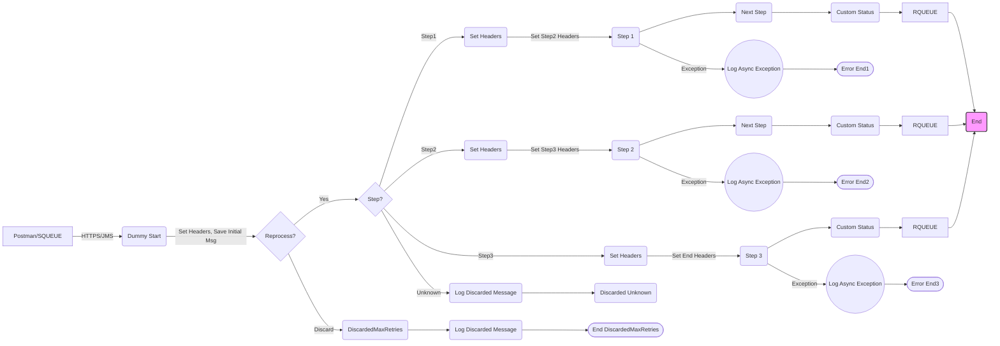

**iFlowId**: SEDA_Model_-_Single_Queue_-_Restart_and_Discard - **iFlowVersion**: 1.0.0

**Functional Summary**

- **Brief description of the iFlow**
This iFlow implements a SEDA (Staged Event-Driven Architecture) pattern with a single JMS queue. It processes messages in multiple steps, handling potential exceptions, retries, and discarding messages that exceed the maximum retry limit or have an unknown step. It also supports starting the iFlow via an HTTPS endpoint.

- **Involved systems**
    - SQUEUE (Sender Queue)
    - RQUEUE (Receiver Queue)
    - Postman (via HTTPS)

- **Used Adapters**
    - JMS (Sender and Receiver)
    - HTTPS (Receiver)

- **Key steps**
    1.  Receive message via HTTPS or JMS from SQUEUE.
    2.  Set initial headers and save the initial message.
    3.  Route the message based on the `Step` property:
        *   Step1: Call Step 1 process, prepare Step 2 message, and send to RQUEUE via JMS
        *   Step2: Call Step 2 process, prepare Step 3 message, and send to RQUEUE via JMS
        *   Step3: Call Step 3 process, and send to RQUEUE via JMS
        *   Unknown: Discard Message
    4.  Handle exceptions in each step using error subprocesses that log the exception.
    5.  Discard messages exceeding `MaxRetries` by logging the discarded message.
    6. Log Async Exceptions in case of any exception and exits the process.

- **Message transformation**
    *   The iFlow uses Enrichers to set headers and properties at various steps. It can use both constants and expressions for the header/property values. There are no other message transformation steps used.

- **Externalized parameters list and their descriptions**
    *   `SEDA_MAIN_QUEUE`: The name of the JMS queue used for message processing.
    *   `Number of Concurrent Processes`:  The number of concurrent processes (Likely for the JMS dispatcher).
    *   `Maximum Retry Interval`: The maximum retry interval when the JMS dispatcher fails to deliver a message.
    *   `Retry Interval`: The retry interval when the JMS dispatcher fails to deliver a message.
    *   `MaxRetries`: The number of retries before the message is discarded.
    *   `Retention Threshold 4 Alerting`: Retention threshold for Alerting.
    *   `Expiration Period`: Expiration period of message in the queue.

- **DataStore / JMS Dependency**
Yes

**Mermaid Diagram**

