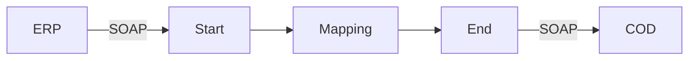

**iFlowId:** Check_Connectivity_from_SAP_Business_Suite_-_REPSOL - **iFlowVersion:** 1.0

**Mermaid Diagram**

**BPMN Diagram**

**Functional Summary**
- **Brief description of the iFlow**
  This iFlow performs an end-to-end connectivity check from SAP ERP to SAP Cloud for Customer (COD) via SAP Integration Suite.

- **Involved systems with Adapters Type and Endpoint Type**
    - ERP (EndpointSender, SOAP Adapter)
    - COD (EndpointRecevier, SOAP Adapter)

- **Key steps**
    1. Receive SOAP request from ERP.
    2. Perform a mapping using `ERP_COD_ConnectivityCheck.opmap`.
    3. Send SOAP request to COD.

- **Message transformation**
    - The iFlow uses an Operation Mapping (`ERP_COD_ConnectivityCheck.opmap`) to transform the message between ERP and COD.

- **Externalized parameters list, configured values and their descriptions**
    - `COD_enableBasicAuthentication_6`: 0 (Enables/disables basic authentication on COD side.)
    - `subject`:  (Subject for authentication)
    - `ERP_wsdlURL_0`: /wsdl/ConnectivityCheckConsumer.wsdl (WSDL URL for the ERP system.)
    - `Port`: 443 (Port number for the COD system.)
    - `artifactname`:  (Credential Name)
    - `ERP_enableBasicAuthentication_8`: true (Enables/disables basic authentication on ERP side.)
    - `pr-key-alias`: KeyPairCod (Private key alias for COD)
    - `Host`: COD (Host name for the COD system.)
    - `ERP_address_1`: /ERP/COD/SimpleConnect (Address for the ERP system.)
    - `issuer`:  (Issuer for authentication)

- **DataStore / JMS Dependency**
  Not Found

- **Cloud Connector Dependency**
  Not Found

- **Common Scripts Dependency**
  Not Found

- **ProcessDirect ComponentType Dependency**
  Not Found