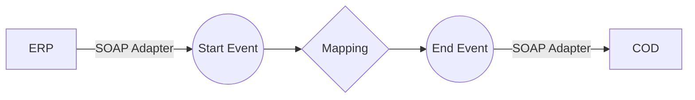

**iFlowId**: Check_Connectivity_from_SAP_Business_Suite_-_REPSOL - **iFlowVersion**: 1.0

**Mermaid Diagram**

**BPMN Diagram**

**Functional Summary**
- **Brief description of the iFlow**
This iFlow performs an end-to-end connectivity check from SAP ERP to SAP Cloud for Customer (COD) via SAP Integration Suite.

- **Involved systems with Adapters Type and Endpoint Type**
    - ERP (EndpointSender) - SOAP Adapter
    - COD (EndpointRecevier) - SOAP Adapter

- **Key steps**
    1.  Receive a request from ERP via SOAP.
    2.  Perform a mapping using the `ERP_COD_ConnectivityCheck.opmap` operation mapping.
    3.  Send the transformed message to COD via SOAP.

- **Message transformation**
    - The iFlow uses `ERP_COD_ConnectivityCheck.opmap` to transform the message between ERP and COD.

- **Externalized parameters list, configured values and their descriptions**
    - `COD_enableBasicAuthentication_6`: Configured Value: 0. Description: No Description available.
    - `subject`: Configured Value: (empty). Description: No Description available.
    - `ERP_wsdlURL_0`: Configured Value: /wsdl/ConnectivityCheckConsumer.wsdl. Description: No Description available.
    - `Port`: Configured Value: 443. Description: No Description available.
    - `artifactname`: Configured Value: (empty). Description: No Description available.
    - `ERP_enableBasicAuthentication_8`: Configured Value: true. Description: No Description available.
    - `pr-key-alias`: Configured Value: KeyPairCod. Description: No Description available.
    - `Host`: Configured Value: COD. Description: No Description available.
    - `ERP_address_1`: Configured Value: /ERP/COD/SimpleConnect. Description: No Description available.
    - `issuer`: Configured Value: (empty). Description: No Description available.

- **DataStore / JMS Dependency**
Not Found

- **Cloud Connector Dependency**
Not Found

- **Common Scripts Dependency**
Not Found

- **ProcessDirect ComponentType Dependency**
Not Found