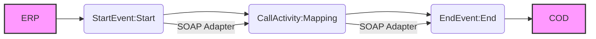

**iFlowId**: Check_Connectivity_from_SAP_Business_Suite_-_REPSOL - **iFlowVersion**: 1.0

**Mermaid Diagram**

**BPMN Diagram**

**Functional Summary**
- **Brief description of the iFlow**
  This iFlow performs an end-to-end connectivity check from SAP ERP to SAP Cloud for Customer (COD) via SAP Integration Suite.

- **Involved systems with Adapters Type and Endpoint Type**
    - ERP (EndpointSender) - SOAP Adapter
    - COD (EndpointRecevier) - SOAP Adapter

- **Key steps**
    1. The iFlow starts with a SOAP sender adapter receiving a request from ERP.
    2. A mapping step transforms the message.
    3. The iFlow ends with a SOAP receiver adapter sending the message to COD.

- **Message transformation**
    - The message is transformed using the `ERP_COD_ConnectivityCheck.opmap` operation mapping.

- **Externalized parameters list, configured values and their descriptions**
    - COD_enableBasicAuthentication_6: 0 (Enables/disables basic authentication for COD)
    - subject:  (Subject for authentication)
    - ERP_wsdlURL_0: /wsdl/ConnectivityCheckConsumer.wsdl (WSDL URL for ERP)
    - Port: 443 (Port for COD connection)
    - artifactname:  (Credential Name for authentication)
    - ERP_enableBasicAuthentication_8: true (Enables/disables basic authentication for ERP)
    - pr-key-alias:  (Private key alias for authentication)
    - Host: COD (Host for COD connection)
    - ERP_address_1: /ERP/COD/SimpleConnect (Address for ERP connection)
    - issuer:  (Issuer for authentication)

- **DataStore / JMS Dependency**
  Not Found

- **Cloud Connector Dependency**
  Not Found

- **Common Scripts Dependency**
  Not Found

- **ProcessDirect ComponentType Dependency**
  Not Found