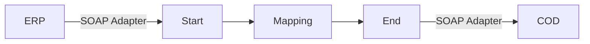

**iFlowId**: Check_Connectivity_from_SAP_Business_Suite_-_REPSOL - **iFlowVersion**: 1.0

**Mermaid Diagram**

**BPMN Diagram**

**Functional Summary**
- **Brief description of the iFlow**
The iFlow performs an end-to-end connectivity check from SAP ERP to SAP Cloud for Customer (COD) via SAP Integration Suite.

- **Involved systems with Adapters Type and Endpoint Type**
    - ERP (EndpointSender): SOAP Adapter
    - COD (EndpointRecevier): SOAP Adapter

- **Key steps**
 1. Receive message from ERP via SOAP adapter.
 2. Perform message mapping using the `ERP_COD_ConnectivityCheck` operation mapping.
 3. Send message to COD via SOAP adapter.

- **Message transformation**
    - An operation mapping named `ERP_COD_ConnectivityCheck` is used to transform the message.

- **Externalized parameters list, configured values and their descriptions**
    - `COD_enableBasicAuthentication_6`: Configured Value: `0`. Description: Not provided in the iFlow definition, but probably enables or disables basic authentication on the COD receiver adapter.
    - `subject`: Configured Value: ``. Description: Not provided, likely related to security certificates.
    - `ERP_wsdlURL_0`: Configured Value: `/wsdl/ConnectivityCheckConsumer.wsdl`. Description: The WSDL URL for the ERP sender adapter.
    - `Port`: Configured Value: `443`. Description: The port used for the COD endpoint.
    - `artifactname`: Configured Value: ``. Description: Name of the credential artifact used for COD.
    - `ERP_enableBasicAuthentication_8`: Configured Value: `true`. Description: Enables basic authentication on the ERP sender adapter.
    - `pr-key-alias`: Configured Value: ``. Description: Alias for the private key.
    - `Host`: Configured Value: `COD`. Description: The host name for the COD endpoint.
    - `ERP_address_1`: Configured Value: `/ERP/COD/SimpleConnect`. Description: The address for the ERP sender adapter.
    - `issuer`: Configured Value: ``. Description: Not provided, likely related to security certificates.

- **DataStore / JMS Dependency**
Not Found

- **Cloud Connector Dependency**
Not Found

- **Common Scripts Dependency**
Not Found

- **ProcessDirect ComponentType Dependency**
Not Found