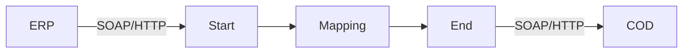

**iFlowId**: Check_Connectivity_from_SAP_Business_Suite_-_REPSOL - **iFlowVersion**: 1.0

**Mermaid Diagram**

**BPMN Diagram**

**Functional Summary**
- **Brief description of the iFlow**
This iFlow performs an end-to-end connectivity check from SAP ERP to SAP Cloud for Customer (COD) via SAP Integration Suite.

- **Involved systems with Adapters Type and Endpoint Type**
  - ERP (EndpointSender) - SOAP Adapter (HTTP)
  - COD (EndpointRecevier) - SOAP Adapter (HTTP)

- **Key steps**
 1. The iFlow is triggered by a message from the ERP system.
 2. The message is then passed to a mapping step.
 3. The mapping step transforms the message using the `ERP_COD_ConnectivityCheck.opmap` operation mapping.
 4. The transformed message is then sent to the COD system.

- **Message transformation**
  - `ERP_COD_ConnectivityCheck.opmap` is used for mapping.

- **Externalized parameters list, configured values and their descriptions**
  - `COD_enableBasicAuthentication_6`: 0
  - `subject`: (empty)
  - `ERP_wsdlURL_0`: /wsdl/ConnectivityCheckConsumer.wsdl
  - `Port`: 443
  - `artifactname`: (empty)
  - `ERP_enableBasicAuthentication_8`: true
  - `pr-key-alias`: (empty)
  - `Host`: COD
  - `ERP_address_1`: /ERP/COD/SimpleConnect
  - `issuer`: (empty)

- **DataStore / JMS Dependency**
Not Found

- **Cloud Connector Dependency**
Not Found

- **Common Scripts Dependency**
Not Found

- **ProcessDirect ComponentType Dependency**
Not Found