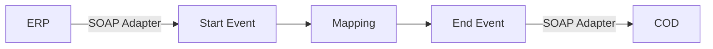

**iFlowId:** Check_Connectivity_from_SAP_Business_Suite_-_REPSOL - **iFlowVersion:** 1.0

**Mermaid Diagram**

**BPMN Diagram**

**Functional Summary**
- **Brief description of the iFlow**
  This iFlow performs an end-to-end connectivity check from SAP ERP to SAP Cloud for Customer (COD) via SAP Integration Suite.

- **Involved systems with Adapters Type and Endpoint Type**
    - ERP (EndpointSender): SOAP Adapter (HTTP transport, Plain SOAP message protocol)
    - COD (EndpointRecevier): SOAP Adapter (HTTP transport, Plain SOAP message protocol)

- **Key steps**
    1. Receive a message from ERP via SOAP.
    2. Perform a mapping using Operation Mapping `ERP_COD_ConnectivityCheck`.
    3. Send the transformed message to COD via SOAP.

- **Message transformation**
    - The iFlow uses the `ERP_COD_ConnectivityCheck` operation mapping located at `dir://opmap/src/main/resources/mapping/ERP_COD_ConnectivityCheck.opmap`.

- **Externalized parameters list, configured values and their descriptions**
    - `COD_enableBasicAuthentication_6`: Configured Value: `0`. Description: Not Available
    - `subject`: Configured Value: ``. Description: Not Available
    - `ERP_wsdlURL_0`: Configured Value: `/wsdl/ConnectivityCheckConsumer.wsdl`. Description: Not Available
    - `Port`: Configured Value: `443`. Description: Not Available
    - `artifactname`: Configured Value: ``. Description: Not Available
    - `ERP_enableBasicAuthentication_8`: Configured Value: `true`. Description: Not Available
    - `pr-key-alias`: Configured Value: ``. Description: Not Available
    - `Host`: Configured Value: `COD`. Description: Not Available
    - `ERP_address_1`: Configured Value: `/ERP/COD/SimpleConnect`. Description: Not Available
    - `issuer`: Configured Value: ``. Description: Not Available

- **DataStore / JMS Dependency**
  Not Found

- **Cloud Connector Dependency**
  Not Found

- **Common Scripts Dependency**
  Not Found

- **ProcessDirect ComponentType Dependency**
  Not Found