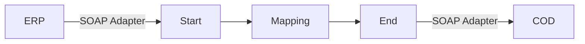

**iFlowId**: Check_Connectivity_from_SAP_Business_Suite_-_REPSOL - **iFlowVersion**: 1.0

**Mermaid Diagram**

**BPMN Diagram**

**Functional Summary**
- **Brief description of the iFlow**
This iFlow performs an end-to-end connectivity check from SAP ERP to SAP Cloud for Customer (COD) via SAP Integration Suite.

- **Involved systems with Adapters Type and Endpoint Type**
  - ERP (EndpointSender): SOAP Adapter
  - COD (EndpointRecevier): SOAP Adapter

- **Key steps**
 1. Receive SOAP message from ERP system.
 2. Perform a mapping using the `ERP_COD_ConnectivityCheck` operation mapping.
 3. Send SOAP message to COD system.

- **Message transformation**
  - The iFlow utilizes the `ERP_COD_ConnectivityCheck` operation mapping located at `dir://opmap/src/main/resources/mapping/ERP_COD_ConnectivityCheck.opmap`.

- **Externalized parameters list, configured values and their descriptions**
  - `COD_enableBasicAuthentication_6`: Configured value: `0`. Description: Enables/disables basic authentication for the COD receiver channel.
  - `subject`: Configured value: ``. Description: Subject for authentication.
  - `ERP_wsdlURL_0`: Configured value: `/wsdl/ConnectivityCheckConsumer.wsdl`. Description: WSDL URL for the ERP sender channel.
  - `Port`: Configured value: `443`. Description: Port for the COD receiver channel.
  - `artifactname`: Configured value: ``. Description: Credential name for authentication.
  - `ERP_enableBasicAuthentication_8`: Configured value: `true`. Description: Enables/disables basic authentication for the ERP sender channel.
  - `pr-key-alias`: Configured value: ``. Description: Private key alias.
  - `Host`: Configured value: `COD`. Description: Host name for the COD receiver channel.
  - `ERP_address_1`: Configured value: `/ERP/COD/SimpleConnect`. Description: Address for the ERP sender channel.
  - `issuer`: Configured value: ``. Description: Issuer for authentication.

- **DataStore / JMS Dependency**
Not Found

- **Cloud Connector Dependency**
Not Found

- **Common Scripts Dependency**
Not Found

- **ProcessDirect ComponentType Dependency**
Not Found