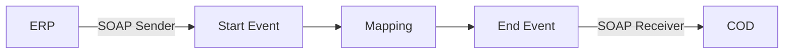

**iFlowId**: Check_Connectivity_from_SAP_Business_Suite_-_REPSOL - **iFlowVersion**: 1.0

**Mermaid Diagram**

**BPMN Diagram**

**Functional Summary**
- **Brief description of the iFlow**
  This iFlow performs an end-to-end connectivity check from SAP ERP to SAP Cloud for Customer (COD) via SAP Integration Suite.

- **Involved systems with Adapters Type and Endpoint Type**
  - ERP (EndpointSender) - SOAP Adapter (Sender)
  - COD (EndpointRecevier) - SOAP Adapter (Receiver)

- **Key steps**
  1.  Receive SOAP message from ERP.
  2.  Map the incoming message using the `ERP_COD_ConnectivityCheck` operation mapping.
  3.  Send SOAP message to COD.

- **Message transformation**
  - Operation Mapping: `ERP_COD_ConnectivityCheck` (src/main/resources/mapping/ERP_COD_ConnectivityCheck.opmap)

- **Externalized parameters list, configured values and their descriptions**
  - `COD_enableBasicAuthentication_6`: 0
  - `subject`: (empty)
  - `ERP_wsdlURL_0`: `/wsdl/ConnectivityCheckConsumer.wsdl`
  - `Port`: 443
  - `artifactname`: (empty)
  - `ERP_enableBasicAuthentication_8`: true
  - `pr-key-alias`: (empty)
  - `Host`: COD
  - `ERP_address_1`: `/ERP/COD/SimpleConnect`
  - `issuer`: (empty)

- **DataStore / JMS Dependency**
  Not Found

- **Cloud Connector Dependency**
  Not Found

- **Common Scripts Dependency**
  Not Found

- **ProcessDirect ComponentType Dependency**
  Not Found