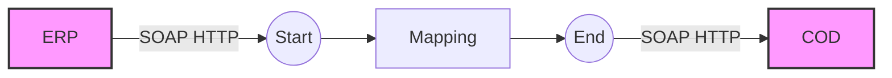

**iFlowId**: Check_Connectivity_from_SAP_Business_Suite_-_REPSOL - **iFlowVersion**: 1.0

**Mermaid Diagram**

**BPMN Diagram**

**Functional Summary**
- **Brief description of the iFlow**
  This iFlow performs an End-to-End connectivity check from SAP ERP to SAP Cloud for Customer (COD) via SAP Integration Suite (HCI).

- **Involved systems with Adapters Type and Endpoint Type**
  - ERP (EndpointSender): SOAP Adapter (HTTP)
  - COD (EndpointRecevier): SOAP Adapter (HTTP)

- **Key steps**
 1.  Receive SOAP message from ERP system.
 2.  Map the message using the `ERP_COD_ConnectivityCheck` mapping.
 3.  Send SOAP message to COD system.

- **Message transformation**
  - Operation Mapping: ERP_COD_ConnectivityCheck

- **Externalized parameters list, configured values and their descriptions**
  - `COD_enableBasicAuthentication_6`: 0 (No Description Found)
  - `subject`:  (No Description Found)
  - `ERP_wsdlURL_0`: /wsdl/ConnectivityCheckConsumer.wsdl (No Description Found)
  - `Port`: 443 (No Description Found)
  - `artifactname`:  (No Description Found)
  - `ERP_enableBasicAuthentication_8`: true (No Description Found)
  - `pr-key-alias`:  (No Description Found)
  - `Host`: COD (No Description Found)
  - `ERP_address_1`: /ERP/COD/SimpleConnect (No Description Found)
  - `issuer`:  (No Description Found)

- **DataStore / JMS Dependency**
  Not Found

- **Cloud Connector Dependency**
  Not Found

- **Common Scripts Dependency**
  Not Found

- **ProcessDirect ComponentType Dependency**
  Not Found