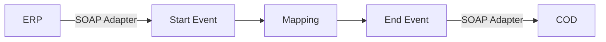

**iFlowId**: Check_Connectivity_from_SAP_Business_Suite_-_REPSOL - **iFlowVersion**: 1.0

**Mermaid Diagram**

**BPMN Diagram**

**Functional Summary**
- **Brief description of the iFlow**
  This iFlow performs an end-to-end connectivity check from SAP ERP to SAP Cloud for Customer (COD) via SAP Integration Suite.

- **Involved systems with Adapters Type and Endpoint Type**
  - ERP (EndpointSender) - SOAP Adapter
  - COD (EndpointRecevier) - SOAP Adapter

- **Key steps**
 1.  Receive SOAP request from ERP system.
 2.  Map the input message to the format expected by COD using an Operation Mapping.
 3.  Send the SOAP request to COD system.

- **Message transformation**
  - ERP_COD_ConnectivityCheck Operation Mapping is used to transform the message.

- **Externalized parameters list, configured values and their descriptions**
  - COD_enableBasicAuthentication_6 = 0 (Enable Basic Authentication on COD receiver SOAP adapter)
  - subject =  (Subject for Authentication)
  - ERP_wsdlURL_0 = /wsdl/ConnectivityCheckConsumer.wsdl (WSDL URL for the ERP sender SOAP adapter)
  - Port = 443 (Port for COD receiver SOAP adapter)
  - artifactname =  (Credential Name)
  - ERP_enableBasicAuthentication_8 = true (Enable Basic Authentication on ERP sender SOAP adapter)
  - pr-key-alias = KeyPairCod (Private Key Alias)
  - Host = COD (Host for COD receiver SOAP adapter)
  - ERP_address_1 = /ERP/COD/SimpleConnect (Address for ERP sender SOAP adapter)
  - issuer =  (Issuer for Authentication)

- **DataStore / JMS Dependency**
  Not Found

- **Cloud Connector Dependency**
  Not Found

- **Common Scripts Dependency**
  Not Found

- **ProcessDirect ComponentType Dependency**
  Not Found