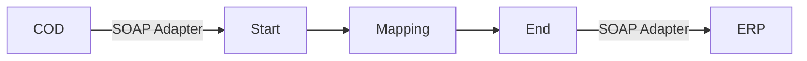

**iFlowId**: Check_Connectivity_to_SAP_Business_Suite_-_REPSOL - **iFlowVersion**: 1.0

**Mermaid Diagram**

**BPMN Diagram**

**Functional Summary**
- **Brief description of the iFlow**
  This iFlow performs an end-to-end connectivity check from SAP Cloud for Customer (COD) to SAP ERP via SAP Integration Suite.

- **Involved systems with Adapters Type and Endpoint Type**
  - COD (EndpointSender): SOAP Adapter
  - ERP (EndpointRecevier): SOAP Adapter

- **Key steps**
  1.  The iFlow is triggered by a message from COD.
  2.  The message is passed to a mapping step.
  3.  The mapped message is sent to ERP.

- **Message transformation**
  - Mapping: `COD_ERP_CheckEnd2EndConnectivity.opmap`

- **Externalized parameters list, configured values and their descriptions**
  - `ERP_authentication_5`: Client Certificate (Authentication type for ERP)
  - `Protocol-Hostname-Port`: https\://erphost\:443 (ERP Hostname and Port)
  - `subject`: cn\=subject (Subject for Client Certificate Authentication)
  - `artifactname`: (Credential Name)
  - `p-key-alias`: (Private Key Alias)
  - `ERP_allowChunking_3`: 1 (Allow Chunking)
  - `issuer`: cn\=issuer (Issuer for Client Certificate Authentication)
  - `ERP_proxyType_4`: default (Proxy Type)
  - `COD_enableBasicAuthentication_3`: true (Enable Basic Authentication for COD)
  - `COD_wsdlURL_1`: /wsdl/CheckConnectivityConsumer.wsdl (WSDL URL for COD)
  - `ERP_cleanupHeaders_2`: 1 (Cleanup Headers)
  - `location-id`: (Location ID)
  - `Client`: 100 (Client Number)
  - `COD_address_2`: /COD/ERP/SimpleConnect (Address for COD)

- **DataStore / JMS Dependency**
  Not Found

- **Cloud Connector Dependency**
  Not Found

- **Common Scripts Dependency**
  Not Found

- **ProcessDirect ComponentType Dependency**
  Not Found