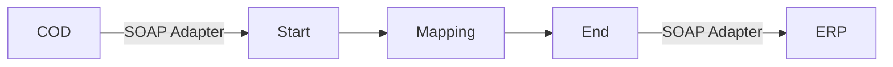

**iFlowId**: Check_Connectivity_to_SAP_Business_Suite_-_REPSOL - **iFlowVersion**: 1.0

**Mermaid Diagram**

**BPMN Diagram**

**Functional Summary**
- **Brief description of the iFlow**
  This iFlow performs an End-to-End connectivity check from SAP Cloud for Customer (COD) to SAP ERP.

- **Involved systems with Adapters Type and Endpoint Type**
  - COD (EndpointSender): SOAP Adapter
  - ERP (EndpointRecevier): SOAP Adapter

- **Key steps**
  1. Receive a message from COD via SOAP.
  2. Perform a mapping using the `COD_ERP_CheckEnd2EndConnectivity.opmap` mapping.
  3. Send the message to ERP via SOAP.

- **Message transformation**
  - The iFlow uses the `COD_ERP_CheckEnd2EndConnectivity.opmap` mapping to transform the message between the COD and ERP systems.

- **Externalized parameters list, configured values and their descriptions**
  - `ERP_authentication_5`: Client Certificate
  - `Protocol-Hostname-Port`: https\://erphost\:443
  - `subject`: cn\=subject
  - `artifactname`:
  - `p-key-alias`:
  - `ERP_allowChunking_3`: 1
  - `issuer`: cn\=issuer
  - `ERP_proxyType_4`: default
  - `COD_enableBasicAuthentication_3`: true
  - `COD_wsdlURL_1`: /wsdl/CheckConnectivityConsumer.wsdl
  - `ERP_cleanupHeaders_2`: 1
  - `location-id`:
  - `Client`: 100
  - `COD_address_2`: /COD/ERP/SimpleConnect

- **DataStore / JMS Dependency**
  Not Found

- **Cloud Connector Dependency**
  Not Found

- **Common Scripts Dependency**
  Not Found

- **ProcessDirect ComponentType Dependency**
  Not Found