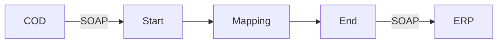

**iFlowId**: Check_Connectivity_to_SAP_Business_Suite_-_REPSOL - **iFlowVersion**: 1.0

**Mermaid Diagram**

**BPMN Diagram**

**Functional Summary**
- **Brief description of the iFlow**
Perform End2End connectivity check from SAP Cloud for Customer to SAP ERP.

- **Involved systems with Adapters Type and Endpoint Type**
    - COD - SOAP - EndpointSender
    - ERP - SOAP - EndpointRecevier

- **Key steps**
    1. Receive SOAP message from COD.
    2. Perform a mapping: COD_ERP_CheckEnd2EndConnectivity.
    3. Send SOAP message to ERP.

- **Message transformation**
    - Mapping: COD_ERP_CheckEnd2EndConnectivity

- **Externalized parameters list, configured values and their descriptions**
    - COD_wsdlURL_1: /wsdl/CheckConnectivityConsumer.wsdl
    - COD_address_2: /COD/ERP/SimpleConnect
    - COD_enableBasicAuthentication_3: true
    - ERP_proxyType_4: default
    - ERP_allowChunking_3: 1
    - ERP_cleanupHeaders_2: 1
    - ERP_authentication_5: Client Certificate
    - artifactname:
    - p-key-alias:
    - Protocol-Hostname-Port: https\://erphost\:443
    - Client: 100
    - location-id:
    - subject: cn\=subject
    - issuer: cn\=issuer

- **DataStore / JMS Dependency**
Not Found

- **Cloud Connector Dependency**
Not Found

- **Common Scripts Dependency**
Not Found

- **ProcessDirect ComponentType Dependency**
Not Found