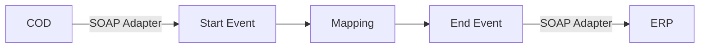

**iFlowId:** Check_Connectivity_to_SAP_Business_Suite_-_REPSOL - **iFlowVersion:** 1.0

**Mermaid Diagram**

**BPMN Diagram**

**Functional Summary**
- **Brief description of the iFlow**
This iFlow performs an end-to-end connectivity check from SAP Cloud for Customer (COD) to SAP ERP via SAP Integration Suite.

- **Involved systems with Adapters Type and Endpoint Type**
    - COD (EndpointSender) - SOAP Adapter
    - ERP (EndpointRecevier) - SOAP Adapter

- **Key steps**
1. The iFlow starts upon receiving a message from COD via the SOAP adapter.
2. The message is then mapped using the "COD_ERP_CheckEnd2EndConnectivity" mapping.
3. Finally, the message is sent to ERP via the SOAP adapter.

- **Message transformation**
The message is transformed using the `COD_ERP_CheckEnd2EndConnectivity.opmap` mapping.

- **Externalized parameters list, configured values and their descriptions**
    - `ERP_authentication_5`: Client Certificate - Authentication method for ERP connection.
    - `Protocol-Hostname-Port`: https\://erphost\:443 - Hostname and port of the ERP system.
    - `subject`: cn\=subject - Subject for the client certificate.
    - `artifactname`: (empty) - Artifact name.
    - `p-key-alias`: (empty) - Private key alias.
    - `ERP_allowChunking_3`: 1 - Flag to allow chunking.
    - `issuer`: cn\=issuer - Issuer for the client certificate.
    - `ERP_proxyType_4`: default - Proxy type for ERP connection.
    - `COD_enableBasicAuthentication_3`: true - Flag to enable basic authentication for COD.
    - `COD_wsdlURL_1`: /wsdl/CheckConnectivityConsumer.wsdl - WSDL URL for the COD service.
    - `ERP_cleanupHeaders_2`: 1 - Flag to cleanup headers for ERP connection.
    - `location-id`: (empty) - Location ID.
    - `Client`: 100 - Client for the ERP system.
    - `COD_address_2`: /COD/ERP/SimpleConnect - Address for the COD service.

- **DataStore / JMS Dependency**
Not Found

- **Cloud Connector Dependency**
Not Found

- **Common Scripts Dependency**
Not Found

- **ProcessDirect ComponentType Dependency**
Not Found