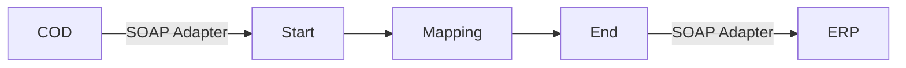

**iFlowId**: Check_Connectivity_to_SAP_Business_Suite_-_REPSOL - **iFlowVersion**: 1.0

**Mermaid Diagram**

**BPMN Diagram**

**Functional Summary**
- **Brief description of the iFlow**
This iFlow performs an end-to-end connectivity check from SAP Cloud for Customer (COD) to SAP ERP via SAP Integration Suite.

- **Involved systems with Adapters Type and Endpoint Type**
    - COD (EndpointSender): SOAP Adapter
    - ERP (EndpointRecevier): SOAP Adapter

- **Key steps**
    1. The iFlow receives a message from the COD system via a SOAP sender adapter.
    2. The message is processed by a mapping step ("COD_ERP_CheckEnd2EndConnectivity") to transform the message format.
    3. The transformed message is sent to the ERP system via a SOAP receiver adapter.

- **Message transformation**
    - A mapping step "COD_ERP_CheckEnd2EndConnectivity" is used to transform the message.

- **Externalized parameters list, configured values and their descriptions**
    - COD_address_2: /COD/ERP/SimpleConnect
    - COD_wsdlURL_1: /wsdl/CheckConnectivityConsumer.wsdl
    - COD_enableBasicAuthentication_3: true
    - ERP_proxyType_4: default
    - issuer: cn=issuer
    - ERP_allowChunking_3: 1
    - p-key-alias: (empty)
    - artifactname: (empty)
    - subject: cn=subject
    - Protocol-Hostname-Port: https://erphost:443
    - ERP_authentication_5: Client Certificate
    - Client: 100
    - location-id: (empty)
    - ERP_cleanupHeaders_2: 1

- **DataStore / JMS Dependency**
    Not Found

- **Cloud Connector Dependency**
    Not Found

- **Common Scripts Dependency**
    Not Found

- **ProcessDirect ComponentType Dependency**
    Not Found