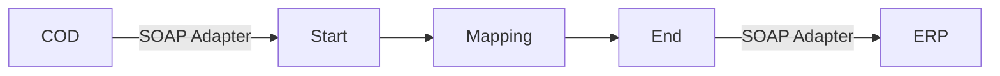

**iFlowId**: Check_Connectivity_to_SAP_Business_Suite_-_REPSOL - **iFlowVersion**: 1.0

**Mermaid Diagram**

**BPMN Diagram**

**Functional Summary**
-   **Brief description of the iFlow**
    This iFlow performs an end-to-end connectivity check from SAP Cloud for Customer (COD) to SAP ERP via SAP Integration Suite (formerly HCI).

-   **Involved systems with Adapters Type and Endpoint Type**
    -   COD (EndpointSender) - SOAP Adapter
    -   ERP (EndpointRecevier) - SOAP Adapter

-   **Key steps**
    1.  The iFlow starts with a message from COD via SOAP adapter.
    2.  A mapping step transforms the message using the `COD_ERP_CheckEnd2EndConnectivity.opmap` mapping.
    3.  The iFlow ends by sending a message to ERP via SOAP adapter.

-   **Message transformation**
    -   `COD_ERP_CheckEnd2EndConnectivity.opmap` is used to map the message.

-   **Externalized parameters list, configured values and their descriptions**
    -   `ERP_authentication_5`: Authentication method for ERP. Configured value: Client Certificate.
    -   `Protocol-Hostname-Port`: Protocol, hostname, and port for ERP. Configured value: `https\://erphost\:443`.
    -   `subject`: Subject for client certificate. Configured value: `cn\=subject`.
    -   `artifactname`: Credential Name. Configured value: ``.
    -   `p-key-alias`: Private Key Alias. Configured value: ``.
    -   `ERP_allowChunking_3`: Allow Chunking. Configured value: 1.
    -   `issuer`: Issuer for client certificate. Configured value: `cn\=issuer`.
    -   `ERP_proxyType_4`: Proxy type for ERP. Configured value: default.
    -   `COD_enableBasicAuthentication_3`: Enable Basic Authentication for COD. Configured value: true.
    -   `COD_wsdlURL_1`: WSDL URL for COD. Configured value: `/wsdl/CheckConnectivityConsumer.wsdl`.
    -   `ERP_cleanupHeaders_2`: Cleanup Headers. Configured value: 1.
    -   `location-id`: Location ID. Configured value: ``.
    -   `Client`: Client ID for ERP. Configured value: 100.
    -   `COD_address_2`: Address for COD. Configured value: `/COD/ERP/SimpleConnect`.

-   **DataStore / JMS Dependency**
    Not Found

-   **Cloud Connector Dependency**
    Not Found

-   **Common Scripts Dependency**
    Not Found

-   **ProcessDirect ComponentType Dependency**
    Not Found