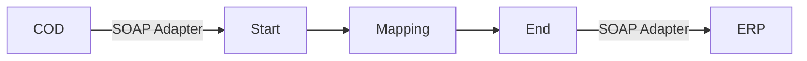

**iFlowId**: Check_Connectivity_to_SAP_Business_Suite_-_REPSOL - **iFlowVersion**: 1.0.4

**Mermaid Diagram**

**BPMN Diagram**

**Functional Summary**
- **Brief description of the iFlow**
This iFlow performs an end-to-end connectivity check from SAP Cloud for Customer (COD) to SAP ERP.

- **Involved systems with Adapters Type and Endpoint Type**
  - COD (EndpointSender) - SOAP Adapter
  - ERP (EndpointRecevier) - SOAP Adapter

- **Key steps**
1.  The iFlow starts with a message from COD.
2.  A mapping step transforms the message.
3.  The iFlow sends the message to ERP.

- **Message transformation**
  - Mapping `COD_ERP_CheckEnd2EndConnectivity.opmap` is used to transform the message.

- **Externalized parameters list, configured values and their descriptions**
  - `ERP_authentication_5`: Basic (Authentication type for ERP)
  - `Protocol-Hostname-Port`: http://erphost:443 (Protocol, hostname, and port for ERP)
  - `subject`: cn=subject (Subject for authentication)
  - `artifactname`: EntryUserPassSAP (Credential name for ERP)
  - `p-key-alias`:  (Private Key Alias)
  - `ERP_allowChunking_3`: 1 (Allow Chunking for ERP)
  - `issuer`: cn=issuer (Issuer for authentication)
  - `ERP_proxyType_4`: sapcc (Proxy type for ERP - SAP Cloud Connector)
  - `COD_enableBasicAuthentication_3`: true (Enable basic authentication for COD)
  - `COD_wsdlURL_1`: /wsdl/CheckConnectivityConsumer.wsdl (WSDL URL for COD)
  - `ERP_cleanupHeaders_2`: 1 (Cleanup headers for ERP)
  - `location-id`: AVVALE_LID (Location ID)
  - `Client`: 100 (Client for ERP)
  - `COD_address_2`: /COD/ERP/SimpleConnect (Address for COD)

- **DataStore / JMS Dependency**
Not Found

- **Cloud Connector Dependency**
Yes

- **Common Scripts Dependency**
Not Found

- **ProcessDirect ComponentType Dependency**
Not Found