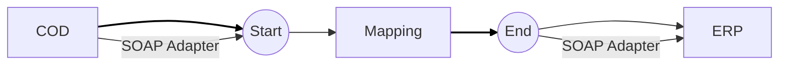

**iFlowId**: Check_Connectivity_to_SAP_Business_Suite_-_REPSOL - **iFlowVersion**: 1.0.4

**Mermaid Diagram**

**BPMN Diagram**

**Functional Summary**
- **Brief description of the iFlow**
This iFlow performs an End-to-End connectivity check from SAP Cloud for Customer (COD) to SAP ERP via SAP Integration Suite.

- **Involved systems with Adapters Type and Endpoint Type**
    - COD (EndpointSender): SOAP Adapter, HTTP Endpoint
    - ERP (EndpointRecevier): SOAP Adapter, HTTP Endpoint

- **Key steps**
    1.  The iFlow starts with a message from COD.
    2.  A mapping step (`COD_ERP_CheckEnd2EndConnectivity.opmap`) transforms the message.
    3.  The transformed message is sent to ERP.

- **Message transformation**
    - Mapping `COD_ERP_CheckEnd2EndConnectivity.opmap` is used to transform the message.

- **Externalized parameters list, configured values and their descriptions**
    - `ERP_authentication_5`: Basic (Authentication method for ERP)
    - `Protocol-Hostname-Port`: http://erphost:443 (Protocol, hostname, and port for ERP)
    - `subject`: cn=subject (Subject for authentication)
    - `artifactname`: EntryUserPassSAP (Credential name for authentication)
    - `p-key-alias`:  (Private key alias)
    - `ERP_allowChunking_3`: 1 (Allow Chunking for ERP)
    - `issuer`: cn=issuer (Issuer for authentication)
    - `ERP_proxyType_4`: sapcc (Proxy type for ERP)
    - `COD_enableBasicAuthentication_3`: true (Enable Basic Authentication for COD)
    - `COD_wsdlURL_1`: /wsdl/CheckConnectivityConsumer.wsdl (WSDL URL for COD)
    - `ERP_cleanupHeaders_2`: 1 (Cleanup Headers for ERP)
    - `location-id`: AVVALE_LID (Location ID)
    - `Client`: 100 (Client for ERP)
    - `COD_address_2`: /COD/ERP/SimpleConnect (Address for COD)

- **DataStore / JMS Dependency**
NotFound

- **Cloud Connector Dependency**
Yes

- **Common Scripts Dependency**
NotFound

- **ProcessDirect ComponentType Dependency**
NotFound