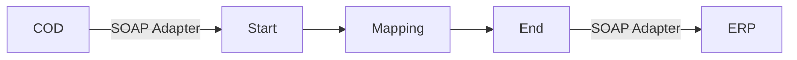

**iFlowId**: Check_Connectivity_to_SAP_Business_Suite_-_REPSOL - **iFlowVersion**: 1.0

**Mermaid Diagram**

**BPMN Diagram**

**Functional Summary**
- **Brief description of the iFlow**
  This iFlow performs an end-to-end connectivity check from SAP Cloud for Customer (COD) to SAP ERP via SAP Integration Suite (HCI).

- **Involved systems with Adapters Type and Endpoint Type**
  - COD (EndpointSender) - SOAP Adapter
  - ERP (EndpointRecevier) - SOAP Adapter

- **Key steps**
  1.  The iFlow starts with a message from COD.
  2.  A mapping step transforms the message.
  3.  The iFlow sends the transformed message to ERP.

- **Message transformation**
  - Mapping: `COD_ERP_CheckEnd2EndConnectivity.opmap` located at `src/main/resources/mapping/COD_ERP_CheckEnd2EndConnectivity`

- **Externalized parameters list, configured values and their descriptions**
  - `ERP_authentication_5`: Client Certificate
  - `Protocol-Hostname-Port`: `https://erphost:443`
  - `subject`: `cn=subject`
  - `artifactname`: *(empty)*
  - `p-key-alias`: *(empty)*
  - `ERP_allowChunking_3`: 1
  - `issuer`: `cn=issuer`
  - `ERP_proxyType_4`: default
  - `COD_enableBasicAuthentication_3`: true
  - `COD_wsdlURL_1`: `/wsdl/CheckConnectivityConsumer.wsdl`
  - `ERP_cleanupHeaders_2`: 1
  - `location-id`: *(empty)*
  - `Client`: 100
  - `COD_address_2`: `/COD/ERP/SimpleConnect`

- **DataStore / JMS Dependency**
  Not Found

- **Cloud Connector Dependency**
  Not Found

- **Common Scripts Dependency**
  Not Found

- **ProcessDirect ComponentType Dependency**
  Not Found