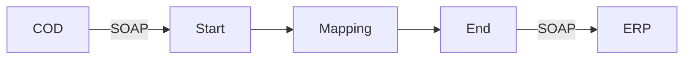

**iFlowId**: Check_Connectivity_to_SAP_Business_Suite_-_REPSOL - **iFlowVersion**: 1.0

**Mermaid Diagram**

**BPMN Diagram**

**Functional Summary**
- **Brief description of the iFlow**
This iFlow performs an end-to-end connectivity check from SAP Cloud for Customer (COD) to SAP ERP via SAP Integration Suite.

- **Involved systems with Adapters Type and Endpoint Type**
    - COD: SOAP (EndpointSender)
    - ERP: SOAP (EndpointRecevier)

- **Key steps**
    1.  Receive request from COD via SOAP adapter.
    2.  Map the request using a message mapping "COD_ERP_CheckEnd2EndConnectivity".
    3.  Send the mapped request to ERP via SOAP adapter.

- **Message transformation**
    - Message mapping: COD_ERP_CheckEnd2EndConnectivity

- **Externalized parameters list, configured values and their descriptions**
    - COD_enableBasicAuthentication_3 = true
    - COD_wsdlURL_1 = /wsdl/CheckConnectivityConsumer.wsdl
    - COD_address_2 = /COD/ERP/SimpleConnect
    - ERP_proxyType_4 = default
    - ERP_authentication_5 = Client Certificate
    - ERP_allowChunking_3 = 1
    - ERP_cleanupHeaders_2 = 1
    - Protocol-Hostname-Port = https://erphost:443
    - Client = 100
    - location-id =
    - artifactname =
    - p-key-alias =
    - subject = cn=subject
    - issuer = cn=issuer

- **DataStore / JMS Dependency**
Not Found

- **Cloud Connector Dependency**
Not Found

- **Common Scripts Dependency**
Not Found

- **ProcessDirect ComponentType Dependency**
Not Found