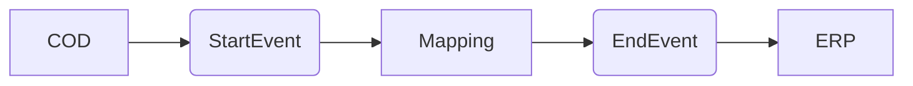

**iFlowId:** Check_Connectivity_to_SAP_Business_Suite_-_REPSOL - **iFlowVersion:** 1.0.4

**Mermaid Diagram**

**BPMN Diagram**

**Functional Summary**
- **Brief description of the iFlow**
This iFlow performs an end-to-end connectivity check from SAP Cloud for Customer (COD) to SAP ERP via SAP Integration Suite.

- **Involved systems with Adapters Type and Endpoint Type**
    - COD: SOAP Adapter, Endpoint Sender
    - ERP: SOAP Adapter, Endpoint Receiver

- **Key steps**
    1.  Receive request from COD system via SOAP adapter.
    2.  Execute a message mapping (COD_ERP_CheckEnd2EndConnectivity).
    3.  Send the mapped message to the ERP system via SOAP adapter.

- **Message transformation**
    - Mapping: COD_ERP_CheckEnd2EndConnectivity.opmap

- **Externalized parameters list, configured values and their descriptions**
    - `ERP_authentication_5`: Client Certificate
    - `Protocol-Hostname-Port`: https\://erphost\:443
    - `subject`: cn\=subject
    - `artifactname`: *empty*
    - `p-key-alias`: *empty*
    - `ERP_allowChunking_3`: 1
    - `issuer`: cn\=issuer
    - `ERP_proxyType_4`: default
    - `COD_enableBasicAuthentication_3`: true
    - `COD_wsdlURL_1`: /wsdl/CheckConnectivityConsumer.wsdl
    - `ERP_cleanupHeaders_2`: 1
    - `location-id`: *empty*
    - `Client`: 100
    - `COD_address_2`: /COD/ERP/SimpleConnect

- **DataStore / JMS Dependency**
Not Found

- **Cloud Connector Dependency**
Not Found

- **Common Scripts Dependency**
Not Found

- **ProcessDirect ComponentType Dependency**
Not Found