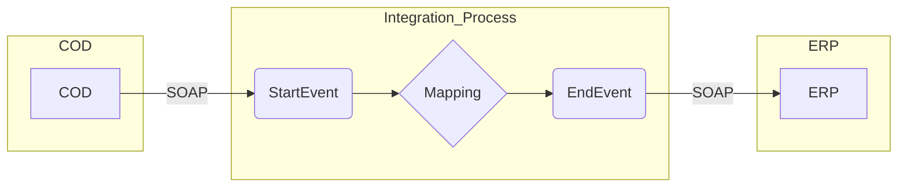

**iFlowId**: Check_Connectivity_to_SAP_Business_Suite_-_REPSOL - **iFlowVersion**: 1.0.5

**Mermaid Diagram**

**BPMN Diagram**

**Functional Summary**
- **Brief description of the iFlow**
This iFlow performs an end-to-end connectivity check from SAP Cloud for Customer (COD) to SAP ERP via SAP Integration Suite (HCI).

- **Involved systems with Adapters Type and Endpoint Type**
  - COD: SOAP, EndpointSender
  - ERP: SOAP, EndpointRecevier

- **Key steps**
 1. The iFlow starts with a message from COD via SOAP adapter.
 2. A mapping step transforms the message (COD_ERP_CheckEnd2EndConnectivity.opmap).
 3. The transformed message is sent to ERP via SOAP adapter.

- **Message transformation**
  - COD_ERP_CheckEnd2EndConnectivity.opmap

- **Externalized parameters list, configured values and their descriptions**
  - ERP_authentication_5: Basic (Authentication type for ERP)
  - Protocol-Hostname-Port: http://erphost:443 (ERP Host Address)
  - subject: cn=subject (Subject)
  - artifactname: EntryUserPassSAP (Credential Name for ERP Authentication)
  - p-key-alias:  (Private Key Alias)
  - ERP_allowChunking_3: 1 (Allow Chunking for ERP connection)
  - issuer: cn=issuer (Issuer)
  - ERP_proxyType_4: sapcc (Proxy Type for ERP connection - SAP Cloud Connector)
  - COD_enableBasicAuthentication_3: true (Enable Basic Authentication for COD)
  - COD_wsdlURL_1: /wsdl/CheckConnectivityConsumer.wsdl (WSDL URL for COD)
  - ERP_cleanupHeaders_2: 1 (Cleanup Headers for ERP Connection)
  - location-id: AVVALE_LID (Location ID for ERP Connection)
  - Client: 100 (Client ID for ERP Connection)
  - COD_address_2: /COD/ERP/SimpleConnect (Address for COD)

- **DataStore / JMS Dependency**
  Not Found

- **Cloud Connector Dependency**
  Yes

- **Common Scripts Dependency**
  Not Found

- **ProcessDirect ComponentType Dependency**
  Not Found