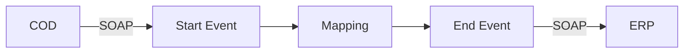

**iFlowId:** com.sap.scenarios.erp2cod.simpleconnectivitytest - **iFlowVersion:** 1.0

**Mermaid Diagram**

**BPMN Diagram**

**Functional Summary**
- **Brief description of the iFlow**
  This iFlow performs an end-to-end connectivity check from SAP Cloud for Customer (COD) to SAP ERP via SAP Integration Suite.

- **Involved systems with Adapters Type and Endpoint Type**
    - COD: SOAP, EndpointSender
    - ERP: SOAP, EndpointRecevier

- **Key steps**
    1. The iFlow starts with a message from the COD system.
    2. A mapping step transforms the message using the `COD_ERP_CheckEnd2EndConnectivity.opmap` mapping.
    3. The transformed message is then sent to the ERP system.

- **Message transformation**
    - `COD_ERP_CheckEnd2EndConnectivity.opmap`

- **Externalized parameters list, configured values and their descriptions**
    - `ERP_authentication_5`: Client Certificate (Authentication method for ERP connection)
    - `Protocol-Hostname-Port`: https\://erphost\:443 (Protocol, hostname and port for ERP)
    - `subject`: cn\=subject (Subject for client certificate)
    - `artifactname`:  (Artifact name for credentials)
    - `p-key-alias`:  (Private key alias for ERP)
    - `ERP_allowChunking_3`: 1 (Allow chunking for ERP connection)
    - `issuer`: cn\=issuer (Issuer for client certificate)
    - `ERP_proxyType_4`: default (Proxy type for ERP connection)
    - `COD_enableBasicAuthentication_3`: true (Enable basic authentication for COD)
    - `COD_wsdlURL_1`: /wsdl/CheckConnectivityConsumer.wsdl (WSDL URL for COD)
    - `ERP_cleanupHeaders_2`: 1 (Cleanup headers for ERP connection)
    - `location-id`:  (Location ID)
    - `Client`: 100 (Client for ERP)
    - `COD_address_2`: /COD/ERP/SimpleConnect (Address for COD)

- **DataStore / JMS Dependency**
  Not Found

- **Cloud Connector Dependency**
  Not Found

- **Common Scripts Dependency**
  Not Found

- **ProcessDirect ComponentType Dependency**
  Not Found