**iFlowId:** EMCS_AEAT_-_REPSOL **- iFlowVersion:** 1.0.6

**Mermaid Diagram**

```mermaid
graph LR
    BC_SENDER[BC_SENDER]
    FIRMA_SIAVAL[FIRMA_SIAVAL]
    AEAT[AEAT]
    DOCUMENTUM[DOCUMENTUM]
    DS_AEAT[DS_AEAT]
    AEAT_Actual[AEAT_Actual]
    
    BC_SENDER -- SOAP --> FirmaProcess(Firma Process)
    FirmaProcess --> ExtractDoc(Extract doc CD815A and parameters)
    ExtractDoc --> CH_STEP(CH_STEP)
    CH_STEP --> Base64Encode(Base64 Encoder)
    Base64Encode --> PrepareSIA(Prepare body to SIA)
    PrepareSIA --> LogRequest1(Log Request)
    LogRequest1 --> SIAService(Request Reply ProcessDirect)
    SIAService -- ProcessDirect --> FIRMA_SIAVAL
    SIAService --> LogResponse1(Log Response)
    LogResponse1 --> CreateStructure(Create Structure to Send Documentum)
    CreateStructure --> SaveToDocumentum(Save To Send Documentum)
    SaveToDocumentum --> SaveHeader(Save Header FacturaeFirmada)
    SaveHeader --> Base64Decoder(Base64 Decoder)
    Base64Decoder --> Router7(Router 7)
    Router7 -- Route1 --> DSAEAT(DS AEAT)
    DSAEAT --> End10(End 10)
    Router7 -- Route2 --> ConvertHeaders(Convert Headers into Properties)
    ConvertHeaders --> DeleteHeaders(Delete Headers)
    DeleteHeaders --> AEATService(Request Reply 2)
    AEATService -- SOAP --> AEAT_Actual
    AEATService --> ExtractRoot(CH_Extract Root Tag)
    ExtractRoot --> GenerateResponse(Generate Response Body)
    GenerateResponse --> End10
    
    FirmaProcess --> MaintainHeaders(Maintain Headers)
    
    SaveHeader --> DataStoreAEAT(DS AEAT)
    
    DataStoreAEAT -- DataStore --> DS_AEAT
    
    AEATService --> SOAP_AEAT(Send AEAT using PD)
    DataStoreAEAT -- DataStore --> DS_FIRMA
    SIAService -- ProcessDirect --> AlertReceiver
    
    

```

**BPMN Diagram**

**Functional Summary**
- **Brief description of the iFlow**
This iFlow handles the process of signing documents and sending them to AEAT (Agencia Estatal de Administración Tributaria - Spanish Tax Agency) and Documentum. It involves data transformation, signing the document using an external service, storing data in datastores, and handling exceptions. It retries sending the document to AEAT.

- **Involved systems with Adapters Type and Endpoint Type**
    - BC_SENDER - SOAP - EndpointSender
    - FIRMA_SIAVAL - ProcessDirect - EndpointRecevier
    - AEAT - SOAP - EndpointRecevier
    - DOCUMENTUM - SOAP - EndpointRecevier
    - DS_AEAT - DataStoreConsumer - EndpointSender
    - DS_FIRMA - DataStoreConsumer - EndpointSender
    - AEAT_Actual - SOAP - EndpointRecevier
    - AlertReceiver - ProcessDirect - EndpointRecevier

- **Key steps**
 1. Receive the SOAP message from BC_SENDER.
 2. Extract document and parameters for signature.
 3. Call external service FIRMA_SIAVAL using ProcessDirect adapter to sign the document.
 4. Store signed document information into DS_AEAT.
 5. Route the message based on `ReplicaFlujoActual` property.
 6. Convert headers into properties.
 7. Send the document to AEAT using the SOAP adapter.
 8. Send signed document to Documentum via SOAP adapter.
 9. Handle exceptions if any occur.
 10. Log request and response.

- **Message transformation**
    -  `CH_archivado.groovy`: Sets custom headers for the Documentum archiving process.
    -  `Payload to JX0`: Wraps the payload in a SOAP envelope for Documentum.
    - `Prepare body to SIA`: Prepares the body for the signing service.
    - `Generate Response Body`: Generates the response body for AEAT.
    - `Create Structure to Send Documentum`: Creates the XML structure to send to Documentum.
    - `CH_STEP_FIRMA y Envio AEAT.groovy`: Sets custom headers related to signing and sending to AEAT.

- **Externalized parameters list, configured values and their descriptions**
    - `data_firma`: ZFACTURAE_FRM_FIRMADO - Description not found
    - `PD_Documentum`: /modules/documentManager/documentum/documents/archiveSAP - Description not found
    - `PathDocumentum`: /D.E.Marketing Europa/Facturas/Sin Procesar - Description not found
    - `SENDER_AUTH`: RoleBased - Description not found
    - `SENDER_BC`: Sender - Description not found
    - `LocationID`: SCC_INT_SUITE_AWS_EU - Description not found
    - `TimeoutUK2`: 120000 - Description not found
    - `DS_NAME`: ZFACTURAE_FRM - Description not found
    - `UserDocumentum`: SVC_TSAPFACGLP@rg.repsol.com - Description not found
    - `HostUX2`: http\://portaluk2.rg.repsol.com\:2543/sap/bc/srt/Idoc - Description not found
    - `RepositorioDocumentum`: reptestdocum - Description not found
    - `DS_FTP`: DS_FTP - Description not found
    - `Sender_Endpoint`: /AEAT/EMCS - Description not found
    - `FacType`: do_fac_glfdeac - Description not found
    - `DS_MAIL_ZFACTURAE_FRM`: DS_MAIL_ZFACTURAE_FRM - Description not found
    - `BAPIRET`: BAPIRET2 - Description not found
    - `PrivateKeyLoginAeat`: ${property.NIF} - Description not found
    - `SENDER_ENDPOINT`: /ZFACTURAE - Description not found
    - `ELK_AUTH`: ELK_LOGGER - Description not found
    - `Logging`: true - Description not found
    - `ELK_LOCATION_ID`:  - Description not found
    - `AEAT_ADDRESS`: https\://prewww1.aeat.es/wlpl/inwinvoc/es.aeat.dit.adu.adi1.emcssw.Ie815V32SOAP - Description not found
    - `MAX_RETRIES`: 2 - Description not found
    - `DS_Bapiret2`: DS_Bapiret2 - Description not found
    - `DS_AEAT`: DS_AEAT - Description not found
    - `Credential_UX2`: SAP UK2 - Description not found
    - `ELK_ENDPOINT`: https\://ingestaelastic.repsol.com\:9200/logs_isuite_poc/_doc - Description not found
    - `SMTP`: smtp.repsol.com\:25 - Description not found
    - `Email_Notification`: true - Description not found
    - `SAP_MessageType`: CD815A - Description not found
    - `AuthJX0`: AuthJX0 - Description not found
    - `ReqSignedToDocumentum`: ReqSignedToDocumentum - Description not found
    - `DS_Mail_Notif`: DS_Mail_Notif - Description not found
    - `DocumentumJX0`: http\://portaljk0.rg.repsol.com\:443/ActualizacionBandejaService/EMCSInternoActualizacionBandeja - Description not found
    - `TimeoutMail`: 30000 - Description not found
    - `ELK_PROXY_TYPE`: Internet - Description not found

- **DataStore / JMS Dependency**
Yes

- **Cloud Connector Dependency**
Yes

- **Common Scripts Dependency**
 - Common_-_Groovy_Logging_Scripts - scriptBundleId

- **ProcessDirect ComponentType Dependency**
- /modules/Signature/SignDoc
- /common/snowIncident