markdown
**iFlowId**: EMCS_AEAT_-_REPSOL - **iFlowVersion**: 1.0.6

**Mermaid Diagram**
- **Visual representation of the flow**

```mermaid
graph LR
    BC_SENDER --> SOAP[SOAP Adapter] --> StartEvent_2
    StartEvent_2 --> CallActivity_20
    CallActivity_20 --> CallActivity_95246099
    CallActivity_95246099 --> CallActivity_95246175
    CallActivity_95246175 --> CallActivity_95246103
    CallActivity_95246103 --> CallActivity_80508921
    CallActivity_80508921 --> CallActivity_95245819
    CallActivity_95245819 --> ServiceTask_7
    ServiceTask_7 --> ProcessDirect[ProcessDirect Adapter] --> FIRMA_SIAVAL
    ServiceTask_7 --> CallActivity_95245816
    CallActivity_95245816 --> CallActivity_95246166
    CallActivity_95246166 --> CallActivity_95246172
    CallActivity_95246172 --> CallActivity_95245924
    CallActivity_95245924 --> CallActivity_95246105
    CallActivity_95246105 --> ExclusiveGateway_95246140
    ExclusiveGateway_95246140 -- Route 1 --> CallActivity_95246108
    CallActivity_95246108 --> EndEvent_95246157
    ExclusiveGateway_95246140 -- Route 2 --> CallActivity_95246143
    CallActivity_95246143 --> CallActivity_95246144
    CallActivity_95246144 --> ServiceTask_95246145
    ServiceTask_95246145 --> CallActivity_95246212
    CallActivity_95246212 --> CallActivity_95246214
    CallActivity_95246214 --> EndEvent_95246157

    StartEvent_80508888 --> ExclusiveGateway_80508899
    ExclusiveGateway_80508899 -- Process --> CallActivity_80508900
    CallActivity_80508900 --> CallActivity_95246198
    CallActivity_95246198 --> CallActivity_80508927
    CallActivity_80508927 --> CallActivity_95246180
    CallActivity_95246180 --> CallActivity_95246177
    CallActivity_95246177 --> ServiceTask_95246189
    ServiceTask_95246189 --> SOAP[SOAP Adapter] --> DOCUMENTUM
    ServiceTask_95246189 --> CallActivity_95245822
    CallActivity_95245822 --> EndEvent_95246193
    ExclusiveGateway_80508899 -- Discard --> CallActivity_80508898
    CallActivity_80508898 --> EndEvent_80508909

    StartEvent_95246114 --> ExclusiveGateway_95246120
    ExclusiveGateway_95246120 -- Route 1 --> CallActivity_95246135
    CallActivity_95246135 --> CallActivity_95246138
    CallActivity_95246138 --> ServiceTask_95246116
    ServiceTask_95246116 --> SOAP[SOAP Adapter] --> AEAT
    ServiceTask_95246116 --> CallActivity_95246208
    CallActivity_95246208 --> CallActivity_95246218
    CallActivity_95246218 --> EndEvent_95246115
    ExclusiveGateway_95246120 -- Discard --> CallActivity_95246121
    CallActivity_95246121 --> EndEvent_95246122

    Participant_95246112 --> DataStore[DataStore Adapter] --> StartEvent_95246114
    Participant_80508887 --> DataStore[DataStore Adapter] --> StartEvent_80508888

    StartEvent_80508843 --> CallActivity_8287205
    CallActivity_8287205 --> ExclusiveGateway_8287208
    ExclusiveGateway_8287208 -- true --> ServiceTask_80508853
    ServiceTask_80508853 --> ProcessDirect[ProcessDirect Adapter] --> AlertReceiver
    ExclusiveGateway_8287208 -- false --> EndEvent_80508844
    ServiceTask_80508853 --> EndEvent_80508844
```

**BPMN Diagram**

**Functional Summary**
- **Brief description of the iFlow**
  This iFlow manages the integration with AEAT (Spanish Tax Agency) and Documentum for EMCS (Excise Movement and Control System) processes related to Repsol. It handles document signing, submission to AEAT, and archival in Documentum.

- **Involved systems with Adapters Type and Endpoint Type**
    - BC_SENDER (SOAP, EndpointSender)
    - FIRMA_SIAVAL (ProcessDirect, EndpointRecevier)
    - AEAT (SOAP, EndpointRecevier)
    - AEAT_Actual (SOAP, EndpointRecevier)
    - DOCUMENTUM (SOAP, EndpointRecevier)
    - DS_AEAT (DataStoreConsumer, EndpointSender)
    - DS_FIRMA (DataStoreConsumer, EndpointSender)
    - AlertReceiver (ProcessDirect, EndpointRecevier)

- **Key steps**
    1. Receives a SOAP request from BC_SENDER.
    2. Extracts payload and parameters, prepares the body for signing, and sends it to FIRMA_SIAVAL via ProcessDirect.
    3. After receiving signed document, it send this document to AEAT using SOAP adapter
    4. Generates the required structure and store into Documentum using SOAP adapter.
    5. Save the signed document to DataStore.
    6. Handle exception in case of errors or receiver not found.

- **Message transformation**
    - Payload is extracted and prepared for signing.
    - Payload is wrapped in specific XML structures for different systems (SIA, Documentum, AEAT).
    - Headers are converted into properties and vice-versa.
    - Base64 encoding/decoding is used for handling signed documents.

- **Externalized parameters list, configured values (read from parameters.prop) and their descriptions**
    - `data_firma`: ZFACTURAE_FRM_FIRMADO (Data type of the firm)
    - `PD_Documentum`: /modules/documentManager/documentum/documents/archiveSAP (Path for Documentum integration)
    - `PathDocumentum`: /D.E.Marketing Europa/Facturas/Sin Procesar (Repository path inside Documentum)
    - `SENDER_AUTH`: RoleBased (Authentication type of sender)
    - `SENDER_BC`: Sender (Name of sender)
    - `LocationID`: SCC_INT_SUITE_AWS_EU (Location ID)
    - `TimeoutUK2`: 120000 (Timeout for UK2)
    - `DS_NAME`: ZFACTURAE_FRM (Datastore name)
    - `UserDocumentum`: SVC_TSAPFACGLP@rg.repsol.com (Username for documentum service)
    - `HostUX2`: http\://portaluk2.rg.repsol.com\:2543/sap/bc/srt/Idoc (Host for UK2 service)
    - `RepositorioDocumentum`: reptestdocum (Documentum repository name)
    - `DS_FTP`: DS_FTP (FTP Datastore name)
    - `Sender_Endpoint`: /AEAT/EMCS (Sender Endpoint URL)
    - `FacType`: do_fac_glfdeac (Type of facture)
    - `DS_MAIL_ZFACTURAE_FRM`: DS_MAIL_ZFACTURAE_FRM (Mail Datastore name for facture)
    - `BAPIRET`: BAPIRET2 (Return message type)
    - `PrivateKeyLoginAeat`: \${property.NIF} (Private key alias for AEAT login)
    - `SENDER_ENDPOINT`: /ZFACTURAE (Sender Endpoint URL)
    - `ELK_AUTH`: ELK_LOGGER (Authentication method for ELK)
    - `Logging`: true (Flag to enable/disable logging)
    - `ELK_LOCATION_ID`:   (ELK location id)
    - `AEAT_ADDRESS`: https\://prewww1.aeat.es/wlpl/inwinvoc/es.aeat.dit.adu.adi1.emcssw.Ie815V32SOAP (AEAT SOAP Address)
    - `MAX_RETRIES`: 2 (Maximum retries)
    - `DS_Bapiret2`: DS_Bapiret2 (Datastore for BAPI Return 2)
    - `DS_AEAT`: DS_AEAT (Datastore name for AEAT)
    - `Credential_UX2`: SAP UK2 (Credentials for UX2)
    - `ELK_ENDPOINT`: https\://ingestaelastic.repsol.com\:9200/logs_isuite_poc/_doc (ELK endpoint URL)
    - `SMTP`: smtp.repsol.com\:25 (SMTP server address)
    - `Email_Notification`: true (Flag to enable/disable email notification)
    - `SAP_MessageType`: CD815A (SAP message type)
    - `AuthJX0`: AuthJX0 (Credentials for JX0)
    - `ReqSignedToDocumentum`: ReqSignedToDocumentum (Datastore name for signed documents for Documentum)
    - `DS_Mail_Notif`: DS_Mail_Notif (Datastore for email notifications)
    - `DocumentumJX0`: http\://portaljk0.rg.repsol.com\:443/ActualizacionBandejaService/EMCSInternoActualizacionBandeja (Endpoint to Documentum)
    - `TimeoutMail`: 30000 (Timeout for Mail process)
    - `ELK_PROXY_TYPE`: Internet (ELK Proxy Type)

- **DataStore / JMS Dependency**
    Yes

- **Cloud Connector Dependency**
    Yes

- **Common Scripts Dependency**
    - Common_-_Groovy_Logging_Scripts (scriptBundleId)
        - Log_XML_Request.groovy
        - Log_XML_Response.groovy
        - Log_Discarded_Message.groovy
        - Log_Exception.groovy

- **ProcessDirect ComponentType Dependency**
    - /modules/Signature/SignDoc
    - /common/snowIncident