markdown
**iFlowId**: EMCS_AEAT_-_REPSOL - **iFlowVersion**: 1.0.6

**Mermaid Diagram**
- **Visual representation of the flow**

```mermaid
graph LR
    Participant_80508819[BC_SENDER]
    StartEvent_2((Start))
    CallActivity_20[Maintain Headers]
    CallActivity_95246099[Extract doc CD815A and parameters]
    CallActivity_95246175[CH_STEP]
    CallActivity_95246103[Base64 Encoder]
    CallActivity_80508921[Prepare body to SIA]
    CallActivity_95245819[Log Request]
    ServiceTask_7[Request Reply]
    CallActivity_95245816[Log Response]
    CallActivity_95246166[Create Structure to Send Documentum]
    CallActivity_95246172[Save To Send Documentum]
    CallActivity_95245924[Save Header FacturaeFirmada]
    CallActivity_95246105[Base64 Decoder 1]
    ExclusiveGateway_95246140{Router 7}
    CallActivity_95246143[Convert Headers into Properties]
    CallActivity_95246144[Delete Headers]
    ServiceTask_95246145[Request Reply 2]
    CallActivity_95246212[CH_Extract Root Tag]
    CallActivity_95246214[Generate Response Body]
    CallActivity_95246108[DS AEAT]
    EndEvent_95246157((End 10))

    Participant_2[FIRMA_SIAVAL]
    Participant_8287215[AlertReceiver]
    Participant_95246153[AEAT_Actual]
    Participant_80508889[DOCUMENTUM]
    
    Participant_80508819 -- SOAP --> StartEvent_2
    StartEvent_2 --> CallActivity_20
    CallActivity_20 --> CallActivity_95246099
    CallActivity_95246099 --> CallActivity_95246175
    CallActivity_95246175 --> CallActivity_95246103
    CallActivity_95246103 --> CallActivity_80508921
    CallActivity_80508921 --> CallActivity_95245819
    CallActivity_95245819 --> ServiceTask_7
    ServiceTask_7 -- ProcessDirect --> Participant_2
    ServiceTask_7 --> CallActivity_95245816
    CallActivity_95245816 --> CallActivity_95246166
    CallActivity_95246166 --> CallActivity_95246172
    CallActivity_95246172 --> CallActivity_95245924
    CallActivity_95245924 --> CallActivity_95246105
    CallActivity_95246105 --> ExclusiveGateway_95246140
    ExclusiveGateway_95246140 -- Route 1 --> CallActivity_95246108
    CallActivity_95246108 --> EndEvent_95246157
    ExclusiveGateway_95246140 -- Route 2 --> CallActivity_95246143
    CallActivity_95246143 --> CallActivity_95246144
    CallActivity_95246144 --> ServiceTask_95246145
    ServiceTask_95246145 --> CallActivity_95246212
    CallActivity_95246212 --> CallActivity_95246214
    CallActivity_95246214 --> EndEvent_95246157

    ServiceTask_95246189[Request Reply 3]
    CallActivity_95246177[Payload to JX0]
    CallActivity_95246180[Base64 Encoder 1]
    CallActivity_95245822[Log Response - Archivado Documentum]

    CallActivity_80508927[Set Custom Headers]

    ServiceTask_95246189 --> CallActivity_95245822
    CallActivity_80508927 --> CallActivity_95246180
    CallActivity_95246180 --> CallActivity_95246177
    ServiceTask_95246189 -- SOAP --> Participant_80508889
    ServiceTask_95246189 -- SOAP --> Participant_80508889
    
    CallActivity_95245822 --> EndEvent_95246157
    CallActivity_95245822 --> EndEvent_95246157
    CallActivity_95245822 --> EndEvent_95246157
    

    ServiceTask_80508853[Notification]
    StartEvent_80508843((Start - Handle Exception))
    CallActivity_8287205[Log Exception - Handle Exception]
    ExclusiveGateway_8287208{Notification?}
    CallActivity_80508867[Log Exception - Error Subprocess]
    StartEvent_80508861((Start - Error Subprocess))
    EndEvent_80508865((End - Error Subprocess))
    EndEvent_80508844((End - Handle Exception))

    StartEvent_80508843 --> CallActivity_8287205
    CallActivity_8287205 --> ExclusiveGateway_8287208
    ExclusiveGateway_8287208 -- true --> ServiceTask_80508853
    ServiceTask_80508853 -- ProcessDirect --> Participant_8287215
    ServiceTask_80508853 --> EndEvent_80508844
    ExclusiveGateway_8287208 -- false --> EndEvent_80508844

    StartEvent_80508861 --> CallActivity_80508867
    CallActivity_80508867 --> EndEvent_80508865
    

    StartEvent_95246114((Start))
    ExclusiveGateway_95246120{Retry?}
    CallActivity_95246135[Convert Headers into Properties]
    CallActivity_95246138[Delete Headers]
    ServiceTask_95246116[Request Reply 1]
    CallActivity_95246208[CH_Extract Root Tag]
    CallActivity_95246218[Generate Response Body - Copy]
    CallActivity_95246121[Log Discarded Message]
    EndEvent_95246115((End 9))
    EndEvent_95246122((Escalation End 2))
    
    Participant_95246112 -- DataStore --> StartEvent_95246114
    
    StartEvent_95246114 --> ExclusiveGateway_95246120
    ExclusiveGateway_95246120 -- Route 1 --> CallActivity_95246135
    CallActivity_95246135 --> CallActivity_95246138
    CallActivity_95246138 --> ServiceTask_95246116
    ServiceTask_95246116 -- SOAP --> Participant_95246113
    ServiceTask_95246116 --> CallActivity_95246208
    CallActivity_95246208 --> CallActivity_95246218
    CallActivity_95246218 --> EndEvent_95246115

    ExclusiveGateway_95246120 -- Discard --> CallActivity_95246121
    CallActivity_95246121 --> EndEvent_95246122
```

**BPMN Diagram**

**Functional Summary**
- **Brief description of the iFlow**
  This iFlow integrates with AEAT (Spanish Tax Agency) and Documentum, handling documents and sending them for signing, then archiving them. It involves data storage, transformation, and exception handling.

- **Involved systems with Adapters Type and Endpoint Type**
  - BC_SENDER - SOAP - HTTP
  - DS_FIRMA - DataStoreConsumer - JDBC
  - DS_AEAT - DataStoreConsumer - JDBC
  - FIRMA_SIAVAL - ProcessDirect - Not Applicable
  - AlertReceiver - ProcessDirect - Not Applicable
  - DOCUMENTUM - SOAP - HTTP
  - AEAT - SOAP - HTTP
  - AEAT_Actual - SOAP - HTTP

- **Key steps**
  1. Receives a message from BC_SENDER via SOAP.
  2. Extracts data and parameters from the payload to sign using a Groovy script.
  3. Transforms and prepares the body for signing by FIRMA_SIAVAL, sending it via ProcessDirect adapter.
  4. Receives the signed document back and saves to Documentum.
  5. Prepares the signed document and sends it to AEAT via SOAP adapter, handling retries if necessary using DataStore.
  6. Sends data to AEAT_Actual via SOAP adapter.
  7. Handles exceptions by logging them and potentially sending notifications via ProcessDirect.

- **Message transformation**
  - Several Groovy scripts are used for message transformation, header manipulation, and data extraction.
  - Enrichers are used to wrap content, delete headers, and create specific XML structures for Documentum and signing services.
  - Base64 encoding and decoding.

- **Externalized parameters list, configured values (read from parameters.prop) and their descriptions**
  - data_firma: ZFACTURAE_FRM_FIRMADO (DataStore name for signed invoices)
  - PD_Documentum: /modules/documentManager/documentum/documents/archiveSAP (ProcessDirect address for Documentum archiving)
  - PathDocumentum: /D.E.Marketing Europa/Facturas/Sin Procesar (Path in Documentum repository)
  - SENDER_AUTH: RoleBased (Sender authentication type)
  - SENDER_BC: Sender (Sender system ID)
  - LocationID: SCC_INT_SUITE_AWS_EU (SCC Location ID)
  - TimeoutUK2: 120000 (Timeout for UK2 system in ms)
  - DS_NAME: ZFACTURAE_FRM (DataStore name for original invoices)
  - UserDocumentum: SVC_TSAPFACGLP@rg.repsol.com (Username for Documentum access)
  - HostUX2: http\://portaluk2.rg.repsol.com\:2543/sap/bc/srt/Idoc (Host for UX2 system)
  - RepositorioDocumentum: reptestdocum (Documentum repository name)
  - DS_FTP: DS_FTP (DataStore for FTP integration)
  - Sender_Endpoint: /AEAT/EMCS (Sender endpoint)
  - FacType: do_fac_glfdeac (Facturae Type)
  - DS_MAIL_ZFACTURAE_FRM: DS_MAIL_ZFACTURAE_FRM (DataStore for email)
  - BAPIRET: BAPIRET2 (BAPI return type)
  - PrivateKeyLoginAeat: Value from property NIF (Private key alias for AEAT login)
  - SENDER_ENDPOINT: /ZFACTURAE (Sender endpoint for ZFACTURAE)
  - ELK_AUTH: ELK_LOGGER (Authentication for ELK)
  - Logging: true (Enable/disable logging)
  - ELK_LOCATION_ID: (ELK Location ID)
  - AEAT_ADDRESS: https\://prewww1.aeat.es/wlpl/inwinvoc/es.aeat.dit.adu.adi1.emcssw.Ie815V32SOAP (AEAT SOAP endpoint address)
  - MAX_RETRIES: 2 (Maximum retries for DataStore operations)
  - DS_Bapiret2: DS_Bapiret2 (DataStore name for BAPI return)
  - DS_AEAT: DS_AEAT (DataStore name for AEAT data)
  - Credential_UX2: SAP UK2 (Credential name)
  - ELK_ENDPOINT: https\://ingestaelastic.repsol.com\:9200/logs_isuite_poc/_doc (ELK endpoint URL)
  - SMTP: smtp.repsol.com\:25 (SMTP server address)
  - Email_Notification: true (Enable/disable email notifications)
  - SAP_MessageType: CD815A (SAP Message Type)
  - AuthJX0: AuthJX0 (Authentication for JX0)
  - ReqSignedToDocumentum: ReqSignedToDocumentum (DataStore name for signing requests to Documentum)
  - DS_Mail_Notif: DS_Mail_Notif (Datastore for Mail Notification)
  - DocumentumJX0: http\://portaljk0.rg.repsol.com\:443/ActualizacionBandejaService/EMCSInternoActualizacionBandeja (Documentum Endpoint address)
  - TimeoutMail: 30000 (Timeout for Mail system in ms)
  - ELK_PROXY_TYPE: Internet (Proxy type for ELK)

- **DataStore / JMS Dependency**
  Yes

- **Cloud Connector Dependency**
  Yes

- **Common Scripts Dependency**
  - Common_-_Groovy_Logging_Scripts:
    - Log_XML_Request.groovy
    - Log_XML_Response.groovy
    - Log_Discarded_Message.groovy
    - Log_Exception.groovy

- **ProcessDirect ComponentType Dependency**
  - /modules/Signature/SignDoc
  - /common/snowIncident