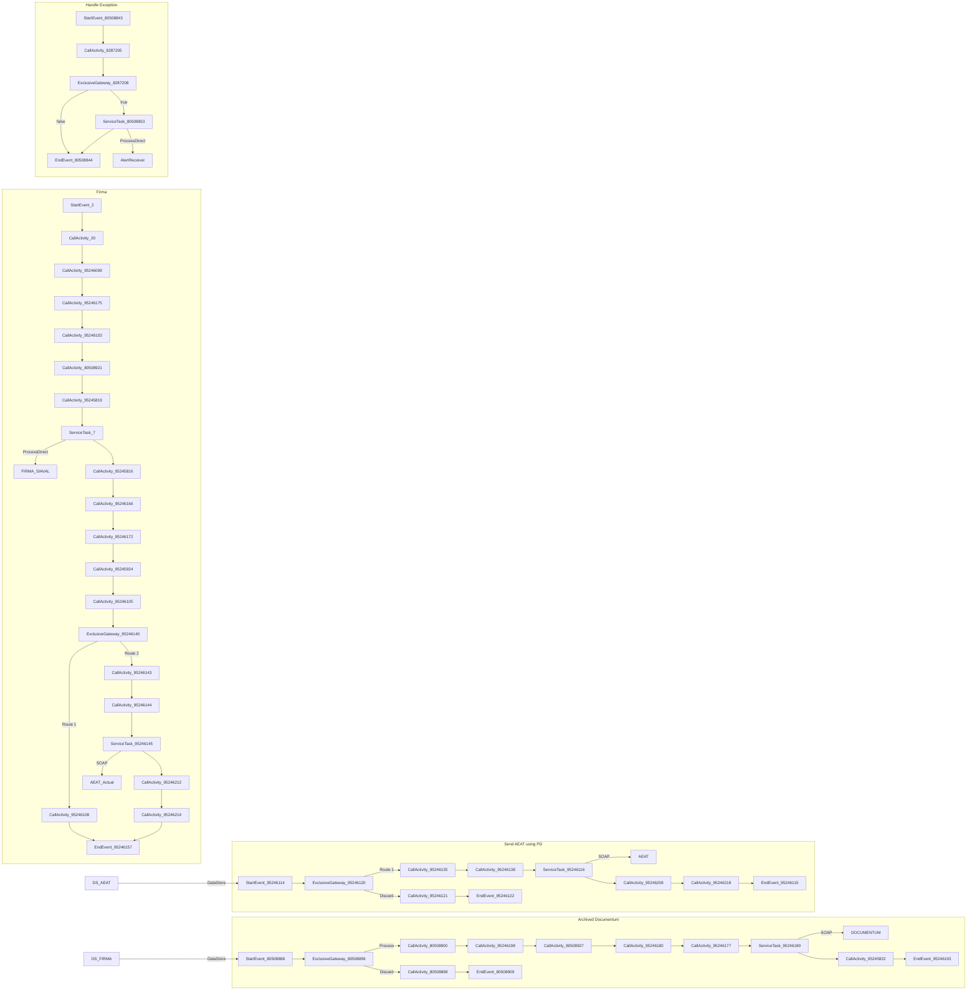

markdown
**iFlowId**: EMCS_AEAT_-_REPSOL - **iFlowVersion**: 1.0.6

**Mermaid Diagram**

**BPMN Diagram**

**Functional Summary**
- **Brief description of the iFlow**
  This iFlow processes and sends documents to AEAT (Spanish Tax Agency) and archives them in Documentum. It involves retrieving data, signing the document, sending it to AEAT using ProcessDirect and SOAP adapters, and archiving the signed document in Documentum via SOAP adapter, along with error handling and logging.

- **Involved systems with Adapters Type and Endpoint Type**
    - BC_SENDER - SOAP - Sender
    - FIRMA_SIAVAL - ProcessDirect - Receiver
    - DS_AEAT - DataStoreConsumer - Sender
    - AEAT - SOAP - Receiver
    - AEAT_Actual - SOAP - Receiver
    - DOCUMENTUM - SOAP - Receiver
    - AlertReceiver - ProcessDirect - Receiver
    - DS_FIRMA - DataStoreConsumer - Sender

- **Key steps**
    1.  Receive request from BC_SENDER system via SOAP.
    2.  Extract the document from the payload.
    3.  Prepare the body for signature and sends the document to the FIRMA_SIAVAL system to be signed via ProcessDirect.
    4.  Create a structure to send the signed document to Documentum and save the document for archiving.
    5.  Consume from DataStore, and send to AEAT (Spanish Tax Agency) using ProcessDirect.
    6.  Send the signed document to AEAT_Actual system using SOAP.
    7.  Archive the signed document in Documentum via SOAP.
    8. Handle any errors and send a notification.

- **Message transformation**
    -   Extract payload to sign.
    -   Prepare body to SIA.
    -   Create structure to send to Documentum.
    -   Payload to JX0 (Documentum).
    -   Generate response body (for both AEAT).
    -   Base64 Encode/Decode operations.
    -   Convert Headers into Properties
    -   Extract RootName
    -   Maintain Headers

- **Externalized parameters list, configured values (read from parameters.prop) and their descriptions**
    -   `data_firma`: ZFACTURAE_FRM_FIRMADO - DataStore name.
    -   `PD_Documentum`: /modules/documentManager/documentum/documents/archiveSAP - ProcessDirect address for Documentum archiving.
    -   `PathDocumentum`: /D.E.Marketing Europa/Facturas/Sin Procesar - Documentum repository path.
    -   `SENDER_AUTH`: RoleBased - Sender authentication type.
    -   `SENDER_BC`: Sender - Sender ID.
    -   `LocationID`: SCC_INT_SUITE_AWS_EU - Location ID for services.
    -   `ReplicaActual`: `${property.ReplicaFlujoActual}` - Property to replicate flow.
    -   `TimeoutUK2`: 120000 - Timeout value for UK2 service.
    -   `DS_NAME`: ZFACTURAE_FRM - DataStore name.
    -   `UserDocumentum`: SVC_TSAPFACGLP@rg.repsol.com - User for Documentum.
    -   `HostUX2`: `http://portaluk2.rg.repsol.com:2543/sap/bc/srt/Idoc` - Host address for UX2 service.
    -   `RepositorioDocumentum`: reptestdocum - Documentum repository name.
    -   `DS_FTP`: DS_FTP - DataStore name for FTP.
    -   `Sender_Endpoint`: /AEAT/EMCS - Sender endpoint.
    -   `FacType`: do_fac_glfdeac - Factura type.
    -   `DS_MAIL_ZFACTURAE_FRM`: DS_MAIL_ZFACTURAE_FRM - DataStore name for mail.
    -   `BAPIRET`: BAPIRET2 - BAPI Return Type.
    -   `PrivateKeyLoginAeat`: `${property.NIF}` - Private Key.
    -   `SENDER_ENDPOINT`: /ZFACTURAE - Sender endpoint.
    -   `ELK_AUTH`: ELK_LOGGER - ELK Authentication.
    -   `Logging`: true - Flag to enable or disable logging.
    -   `ELK_LOCATION_ID`:  - ELK Location ID.
    -   `AEAT_ADDRESS`: `https://prewww1.aeat.es/wlpl/inwinvoc/es.aeat.dit.adu.adi1.emcssw.Ie815V32SOAP` - AEAT address.
    -   `MAX_RETRIES`: 2 - Maximum number of retries for DataStore.
    -   `DS_Bapiret2`: DS_Bapiret2 - Datastore name for BAPI Return.
    -   `DS_AEAT`: DS_AEAT - DataStore name for AEAT.
    -   `ReplicaFlujoActual`: `${property.ReplicaFlujoActual} == true` - Property to indicate actual flow replica.
    -   `Credential_UX2`: SAP UK2 - Credential for UX2 service.
    -   `ELK_ENDPOINT`: `https://ingestaelastic.repsol.com:9200/logs_isuite_poc/_doc` - ELK endpoint.
    -   `SMTP`: smtp.repsol.com:25 - SMTP server address.
    -   `Email_Notification`: true - Flag to enable or disable email notification.
    -   `SAP_MessageType`: CD815A - SAP Message Type.
    -   `AuthJX0`: AuthJX0 - Authentication alias for JX0 system.
    -   `ReqSignedToDocumentum`: ReqSignedToDocumentum - DataStore name for request to Documentum.
    -   `DS_Mail_Notif`: DS_Mail_Notif - DataStore for Mail Notification
    -   `DocumentumJX0`: `http://portaljk0.rg.repsol.com:443/ActualizacionBandejaService/EMCSInternoActualizacionBandeja` - Endpoint of Documentum.
    -   `TimeoutMail`: 30000 - Timeout value for email service.
    -   `ELK_PROXY_TYPE`: Internet - Proxy Type for ELK.

- **DataStore / JMS Dependency**
    Yes

- **Cloud Connector Dependency**
    Yes

- **Common Scripts Dependency**
    - Common_-_Groovy_Logging_Scripts - `Log_XML_Request.groovy`
    - Common_-_Groovy_Logging_Scripts - `Log_XML_Response.groovy`
    - Common_-_Groovy_Logging_Scripts - `Log_Discarded_Message.groovy`
    - Common_-_Groovy_Logging_Scripts - `Log_Exception.groovy`

- **ProcessDirect ComponentType Dependency**
    - /modules/Signature/SignDoc
    - /common/snowIncident