markdown
**iFlowId**: EMCS_AEAT_-_REPSOL - **iFlowVersion**: 1.0.6

**Mermaid Diagram**

```mermaid
graph LR
    BC_SENDER --> SOAP --> StartEvent_2(Start)
    StartEvent_2 --> MaintainHeaders(Maintain Headers)
    MaintainHeaders --> ExtractDoc(Extract doc CD815A and parameters)
    ExtractDoc --> CH_STEP(CH_STEP)
    CH_STEP --> Base64Encode(Base64 Encoder)
    Base64Encode --> PrepareBody(Prepare body to SIA)
    PrepareBody --> LogRequest(Log Request)
    LogRequest --> RequestReply(Request Reply)
    RequestReply --> LogResponse(Log Response)
    LogResponse --> CreateStructure(Create Structure to Send Documentum)
    CreateStructure --> SaveToDataStore(Save To Send Documentum)
    SaveToDataStore --> SaveHeader(Save Header FacturaeFirmada)
    SaveHeader --> Base64Decoder(Base64 Decoder 1)
    Base64Decoder --> Router(Router 7)
    Router -- Route1 --> DSAEAT(DS AEAT)
    DSAEAT --> EndEvent(End 10)
    Router -- Route2 --> ConvertHeaders(Convert Headers into Properties)
    ConvertHeaders --> DeleteHeaders(Delete Headers)
    DeleteHeaders --> RequestReply2(Request Reply 2)
    RequestReply2 --> ExtractRootTag(CH_Extract Root Tag)
    ExtractRootTag --> GenerateResponseBody(Generate Response Body)
    GenerateResponseBody --> EndEvent

    StartEvent_80508888(Start 5) --> ExclusiveGateway_80508899{Retry?}
    ExclusiveGateway_80508899 -- Process --> CallActivity_80508900(Maintain Headers)
    CallActivity_80508900 --> CallActivity_95246198(Log Request)
    CallActivity_95246198 --> CallActivity_80508927(Set Custom Headers)
    CallActivity_80508927 --> CallActivity_95246180(Base64 Encoder 1)
    CallActivity_95246180 --> CallActivity_95246177(Payload to JX0)
    CallActivity_95246177 --> ServiceTask_95246189(Request Reply 3)
    ServiceTask_95246189 --> CallActivity_95245822(Log Response)
    CallActivity_95245822 --> EndEvent_95246193(End 11)
    ServiceTask_95246189 --> SOAP --> DOCUMENTUM

    ExclusiveGateway_80508899 -- Discard --> CallActivity_80508898(Log Discarded Message)
    CallActivity_80508898 --> EndEvent_80508909(Escalation End 2)

    StartEvent_95246114(Start 6) --> ExclusiveGateway_95246120{Retry?}
    ExclusiveGateway_95246120 -- Route1 --> CallActivity_95246135(Convert Headers into Properties)
    CallActivity_95246135 --> CallActivity_95246138(Delete Headers)
    CallActivity_95246138 --> ServiceTask_95246116(Request Reply 1)
    ServiceTask_95246116 --> CallActivity_95246208(CH_Extract Root Tag)
    CallActivity_95246208 --> CallActivity_95246218(Generate Response Body - Copy)
    CallActivity_95246218 --> EndEvent_95246115(End 9)
    ServiceTask_95246116 --> SOAP --> AEAT

    ExclusiveGateway_95246120 -- Discard --> CallActivity_95246121(Log Discarded Message)
    CallActivity_95246121 --> EndEvent_95246122(Escalation End 2)

    DS_AEAT --> DataStore --> StartEvent_95246114
    DS_FIRMA --> DataStore --> StartEvent_80508888

    ServiceTask_7 --> ProcessDirect --> FIRMA_SIAVAL
    ServiceTask_80508853(Notification) --> ProcessDirect --> AlertReceiver

    StartEvent_80508843(Start 4) --> CallActivity_8287205(Log Exception)
    CallActivity_8287205 --> ExclusiveGateway_8287208{Notification?}
    ExclusiveGateway_8287208 -- true --> ServiceTask_80508853
    ServiceTask_80508853 --> EndEvent_80508844(End 4)
    ExclusiveGateway_8287208 -- false --> EndEvent_80508844

```

**BPMN Diagram**

**Functional Summary**
- **Brief description of the iFlow**
This iFlow manages the process of sending documents to AEAT (Spanish Tax Agency) and archiving them in Documentum. It involves signing documents, handling exceptions, and logging events. It retrieves signed documents, transforms them, and sends them using different adapters based on the configuration and conditions.

- **Involved systems with Adapters Type and Endpoint Type**
    - BC_SENDER - SOAP - EndpointSender
    - DS_FIRMA - DataStoreConsumer - EndpointSender
    - DS_AEAT - DataStoreConsumer - EndpointSender
    - FIRMA_SIAVAL - ProcessDirect - EndpointRecevier
    - AlertReceiver - ProcessDirect - EndpointRecevier
    - DOCUMENTUM - SOAP - EndpointRecevier
    - AEAT - SOAP - EndpointRecevier
    - AEAT_Actual - SOAP - EndpointRecevier

- **Key steps**
 1. Receives a SOAP message from BC_SENDER.
 2. Extracts data and parameters from the payload.
 3. Transforms the payload to prepare it for signing.
 4. Sends the prepared body to FIRMA_SIAVAL for signing via ProcessDirect.
 5. Processes the signed document from FIRMA_SIAVAL.
 6. Sends the signed document to AEAT (via SOAP) using ProcessDirect, or sends to AEAT_Actual using SOAP Adapter.
 7. Stores a copy of the signed request to Datastore for AEAT calls.
 8. Creates structure to send signed document to Documentum via SOAP.
 9. Stores a copy of the signed request to Datastore for Documentum calls.
 10. Handles exceptions, logs events, and sends notifications via ProcessDirect to AlertReceiver.
 11. Sends response body generated to the initial BC_SENDER caller.

- **Message transformation**
    - `Extract payload to sign.groovy`: Extracts the document for signing.
    - `CH_STEP_FIRMA y Envio AEAT.groovy`:  Sets headers for firma and AEAT sending.
    - `Prepare body to SIA`: Wraps the document within a SOAP envelope for the signing service.
    - `Conversion headers a properties.groovy`: Converts incoming headers into properties for dynamic routing.
    - `Payload to JX0`: Wraps the payload within a SOAP envelope for Documentum.
    - `Extraer RootName.groovy`: Extracts the root tag name for generating responses.
    - `Generate Response Body`: Creates the response body structure.
    - `Generate Response Body - Copy`: Creates the response body structure for the AEAT step.
    - `CH_archivado.groovy`: Script to set custom headers in the "Archivado Documentum" process
    - `Base64 Encode/Decode`: Used for encoding/decoding at various steps.

- **Externalized parameters list, configured values and their descriptions**
    - `data_firma`: ZFACTURAE_FRM_FIRMADO - Unknown
    - `PD_Documentum`: /modules/documentManager/documentum/documents/archiveSAP - Unknown
    - `PathDocumentum`: /D.E.Marketing Europa/Facturas/Sin Procesar - Unknown
    - `SENDER_AUTH`: RoleBased - Unknown
    - `SENDER_BC`: Sender - Unknown
    - `LocationID`: SCC_INT_SUITE_AWS_EU - Unknown
    - `ReplicaActual`: `${property.ReplicaFlujoActual}` - Unknown
    - `TimeoutUK2`: 120000 - Unknown
    - `DS_NAME`: ZFACTURAE_FRM - Unknown
    - `UserDocumentum`: SVC_TSAPFACGLP@rg.repsol.com - Unknown
    - `HostUX2`: http\://portaluk2.rg.repsol.com\:2543/sap/bc/srt/Idoc - Unknown
    - `RepositorioDocumentum`: reptestdocum - Unknown
    - `DS_FTP`: DS_FTP - Unknown
    - `Sender_Endpoint`: /AEAT/EMCS - Unknown
    - `FacType`: do_fac_glfdeac - Unknown
    - `DS_MAIL_ZFACTURAE_FRM`: DS_MAIL_ZFACTURAE_FRM - Unknown
    - `BAPIRET`: BAPIRET2 - Unknown
    - `PrivateKeyLoginAeat`: `${property.NIF}` - Unknown
    - `SENDER_ENDPOINT`: /ZFACTURAE - Unknown
    - `ELK_AUTH`: ELK_LOGGER - Unknown
    - `Logging`: true - Unknown
    - `ELK_LOCATION_ID`:  - Unknown
    - `AEAT_ADDRESS`: https\://prewww1.aeat.es/wlpl/inwinvoc/es.aeat.dit.adu.adi1.emcssw.Ie815V32SOAP - Unknown
    - `MAX_RETRIES`: 2 - Unknown
    - `DS_Bapiret2`: DS_Bapiret2 - Unknown
    - `DS_AEAT`: DS_AEAT - Unknown
    - `ReplicaFlujoActual`: `${property.ReplicaFlujoActual} \=\= true` - Unknown
    - `Credential_UX2`: SAP UK2 - Unknown
    - `ELK_ENDPOINT`: https\://ingestaelastic.repsol.com\:9200/logs_isuite_poc/_doc - Unknown
    - `SMTP`: smtp.repsol.com\:25 - Unknown
    - `Email_Notification`: true - Unknown
    - `SAP_MessageType`: CD815A - Unknown
    - `AuthJX0`: AuthJX0 - Unknown
    - `ReqSignedToDocumentum`: ReqSignedToDocumentum - Unknown
    - `DS_Mail_Notif`: DS_Mail_Notif - Unknown
    - `DocumentumJX0`: http\://portaljk0.rg.repsol.com\:443/ActualizacionBandejaService/EMCSInternoActualizacionBandeja - Unknown
    - `TimeoutMail`: 30000 - Unknown
    - `ELK_PROXY_TYPE`: Internet - Unknown

- **DataStore / JMS Dependency**
Yes

- **Cloud Connector Dependency**
Yes

- **Common Scripts Dependency**
    - Common_-_Groovy_Logging_Scripts - `Log_XML_Request.groovy`
    - Common_-_Groovy_Logging_Scripts - `Log_XML_Response.groovy`
    - Common_-_Groovy_Logging_Scripts - `Log_Discarded_Message.groovy`
    - Common_-_Groovy_Logging_Scripts - `Log_Exception.groovy`

- **ProcessDirect ComponentType Dependency**
    - /modules/Signature/SignDoc
    - /common/snowIncident