markdown
**iFlowId**: EMCS_AEAT_-_REPSOL - **iFlowVersion**: 1.0.6

**Mermaid Diagram**

```mermaid
graph LR
    BC_SENDER --> SOAP --SOAP--> StartEvent_2
    StartEvent_2 --> MaintainHeaders
    MaintainHeaders --> ExtractPayload
    ExtractPayload --> CH_STEP
    CH_STEP --> Base64Encoder
    Base64Encoder --> PrepareSIA
    PrepareSIA --> LogRequest
    LogRequest --> ProcessDirect --ProcessDirect--> FIRMA_SIAVAL
    ProcessDirect --> LogResponse
    LogResponse --> CreateStructure
    CreateStructure --> SaveToDocumentum
    SaveToDocumentum --> SaveHeader

    SaveHeader --> Base64Decoder
    Base64Decoder --> Router
    Router -- Route1 --> DSAEAT
    DSAEAT --> EndEvent
    Router -- Route2 -->ConvertHeaders
    ConvertHeaders --> DeleteHeaders
    DeleteHeaders --> RequestReply --SOAP--> AEAT_Actual
    RequestReply --> ExtracRootTag
    ExtracRootTag --> GenerateResponseBody
    GenerateResponseBody --> EndEvent

    EndEvent --> SaveHeader
    

    SaveToDocumentum --> SOAP_Documentum --SOAP--> DOCUMENTUM
    style DOCUMENTUM fill:#f9f,stroke:#333,stroke-width:2px
    style BC_SENDER fill:#f9f,stroke:#333,stroke-width:2px

    DS_AEAT --> StartEvent_Aeat
    StartEvent_Aeat --> Gateway
    Gateway -- Route1 --> ConvertHeaders2
    ConvertHeaders2 --> DeleteHeaders2
    DeleteHeaders2 --> RequestReply_AEAT --SOAP--> AEAT
    RequestReply_AEAT --> ExtracRootTag_AEAT
    ExtracRootTag_AEAT --> GenerateResponseBody_AEAT
    GenerateResponseBody_AEAT --> EndEvent_AEAT
    Gateway -- Discard --> LogDiscarded

    DS_Firma --> StartEvent_Documentum
    

    style DS_AEAT fill:#f9f,stroke:#333,stroke-width:2px
    style DS_Firma fill:#f9f,stroke:#333,stroke-width:2px
    style FIRMA_SIAVAL fill:#f9f,stroke:#333,stroke-width:2px
    style AEAT fill:#f9f,stroke:#333,stroke-width:2px
    

    subgraph FirmaProcess [Firma Process]
    MaintainHeaders
    ExtracRootTag
    EndEvent
    CreateStructure
    Gateway
    EndEvent_AEAT
    ExtracRootTag_AEAT
    GenerateResponseBody_AEAT
    ProcessDirect
    CreateStructure
    SaveToDocumentum
    LogDiscarded
    ConvertHeaders
    DeleteHeaders
    RequestReply_AEAT
    GenerateResponseBody
    
    end

    subgraph EnviarAEAT [Enviar AEAT]
    ConvertHeaders2
    DeleteHeaders2
    RequestReply
    LogDiscarded
    StartEvent_Aeat
    DSAEAT
    end

    subgraph AArchivadoDocumentum [Archivado Documentum]
    SOAP_Documentum
    end

    subgraph Firma_SIAVAL_Subgraph [FIRMA_SIAVAL]
     FIRMA_SIAVAL
     end

     subgraph AEAT_Subgraph [AEAT]
     AEAT
     end

      subgraph DOCUMENTUM_Subgraph [DOCUMENTUM]
     DOCUMENTUM
     end

    
```

**BPMN Diagram**

**Functional Summary**
- **Brief description of the iFlow**
This iFlow handles the processing of documents, including signing them, sending them to AEAT (Spanish Tax Agency), and archiving them in Documentum. It involves several integration processes for handling exceptions, signing documents, sending data to AEAT using ProcessDirect, and archiving documents in Documentum.

- **Involved systems with Adapters Type and Endpoint Type**
    - BC_SENDER - SOAP - EndpointSender
    - DS_FIRMA - DataStoreConsumer - EndpointSender
    - DS_AEAT - DataStoreConsumer - EndpointSender
    - FIRMA_SIAVAL - ProcessDirect - EndpointRecevier
    - AlertReceiver - ProcessDirect - EndpointRecevier
    - DOCUMENTUM - SOAP - EndpointRecevier
    - AEAT - SOAP - EndpointRecevier
    - AEAT_Actual - SOAP - EndpointRecevier

- **Key steps**
 1. Receives a document via SOAP from BC_SENDER.
 2. Extracts document content and related parameters using Groovy script 'Extract payload to sign.groovy'.
 3. Signs the document through ProcessDirect using the FIRMA_SIAVAL system.
 4. Converts the signed document to Base64 format.
 5. Prepares data to send it to AEAT via SOAP and/or Datastore.
 6. Sends the signed document to AEAT using either SOAP adapter or via DataStore.
 7. Creates a structure to send the document to Documentum, including base64 encoded document content and metadata.
 8. Sends the document to Documentum via SOAP adapter.
 9. Logs requests and responses using Groovy scripts.
 10. Handles exceptions and sends notifications if required.

- **Message transformation**
    - 'Extract payload to sign.groovy': Extracts the payload to be signed.
    - 'CH_STEP_FIRMA y Envio AEAT.groovy': Sets Custom Headers.
    - 'Base64 Encoder': Encodes to Base64
    - 'Prepare body to SIA': Wraps content in `DocumentSignModuleRequest` XML structure
    - 'Create Structure to Send Documentum': Creates an XML structure to encapsulate the signed document before sending to Documentum.
    - 'Conversion headers a properties.groovy': Transform Headers into Properties

- **Externalized parameters list, configured values (read from parameters.prop) and their descriptions**
    - data_firma: ZFACTURAE_FRM_FIRMADO - DataStore name for signed documents.
    - PD_Documentum: /modules/documentManager/documentum/documents/archiveSAP - ProcessDirect address for Documentum archiving.
    - PathDocumentum: /D.E.Marketing Europa/Facturas/Sin Procesar - Documentum folder path.
    - SENDER_AUTH: RoleBased - Sender authentication type.
    - SENDER_BC: Sender - Sender ID.
    - LocationID: SCC_INT_SUITE_AWS_EU - Location ID.
    - ReplicaActual: ${property.ReplicaFlujoActual} - Flag to indicate replica flow.
    - TimeoutUK2: 120000 - Timeout for UK2 system.
    - DS_NAME: ZFACTURAE_FRM - DataStore name for invoices.
    - UserDocumentum: SVC_TSAPFACGLP@rg.repsol.com - Documentum user ID.
    - HostUX2: http\://portaluk2.rg.repsol.com\:2543/sap/bc/srt/Idoc - Host address for UX2.
    - RepositorioDocumentum: reptestdocum - Documentum repository name.
    - DS_FTP: DS_FTP - DataStore name for FTP.
    - Sender_Endpoint: /AEAT/EMCS - Sender endpoint.
    - FacType: do_fac_glfdeac - Invoice type.
    - DS_MAIL_ZFACTURAE_FRM: DS_MAIL_ZFACTURAE_FRM - DataStore for email notification.
    - BAPIRET: BAPIRET2 - BAPI return structure name.
    - PrivateKeyLoginAeat: ${property.NIF} - Private key alias for AEAT login.
    - SENDER_ENDPOINT: /ZFACTURAE - Sender Endpoint.
    - ELK_AUTH: ELK_LOGGER - ELK Authentication method
    - Logging: true - Logging enabled/disabled.
    - ELK_LOCATION_ID:  - ELK Location ID.
    - AEAT_ADDRESS: https\://prewww1.aeat.es/wlpl/inwinvoc/es.aeat.dit.adu.adi1.emcssw.Ie815V32SOAP - AEAT endpoint address.
    - MAX_RETRIES: 2 - Maximum number of retries.
    - DS_Bapiret2: DS_Bapiret2 - DataStore for BAPI returns.
    - DS_AEAT: DS_AEAT - DataStore name for AEAT.
    - Credential_UX2: SAP UK2 - Credential name for SAP UK2.
    - ELK_ENDPOINT: https\://ingestaelastic.repsol.com\:9200/logs_isuite_poc/_doc - ELK endpoint.
    - SMTP: smtp.repsol.com\:25 - SMTP server address.
    - Email_Notification: true - Email notification enabled/disabled.
    - SAP_MessageType: CD815A - SAP message type.
    - AuthJX0: AuthJX0 - Authentication Documentum.
    - ReqSignedToDocumentum: ReqSignedToDocumentum - Datastore to send to documentum after firma
    - DS_Mail_Notif: DS_Mail_Notif - Datastore Email Notification
    - DocumentumJX0: http\://portaljk0.rg.repsol.com\:443/ActualizacionBandejaService/EMCSInternoActualizacionBandeja - Address to Documentum
    - TimeoutMail: 30000 - Timeout Mail.
    - ELK_PROXY_TYPE: Internet - ELK Proxy Type.

- **DataStore / JMS Dependency**
Yes

- **Cloud Connector Dependency**
Yes

- **Common Scripts Dependency**
    - Common_-_Groovy_Logging_Scripts (scriptBundleId)
        - Log_XML_Request.groovy
        - Log_XML_Response.groovy
        - Log_Discarded_Message.groovy
        - Log_Exception.groovy

- **ProcessDirect ComponentType Dependency**
    - /modules/Signature/SignDoc
    - /common/snowIncident