**iFlowId**: EMCS_AEAT_-_REPSOL - **iFlowVersion**: 1.0.6

**Mermaid Diagram**
- **Visual representation of the flow**

```mermaid
graph LR
    BC_SENDER --> SOAP[Start]
    SOAP --> MH[Maintain Headers]
    MH --> ED[Extract doc CD815A and parameters]
    ED --> CH[CH_STEP]
    CH --> BE[Base64 Encoder]
    BE --> PB[Prepare body to SIA]
    PB --> LREQ[Log Request]
    LREQ --> RR[Request Reply]
    RR --> LRES[Log Response]
    LRES --> CS[Create Structure to Send Documentum]
    CS --> SDS[Save To Send Documentum]
    SDS --> SF[Save Header FacturaeFirmada]
    SF --> BD[Base64 Decoder 1]
    BD --> Router[Router 7]
    Router -- Route 1 --> DSA[DS AEAT]
    DSA --> End
    Router -- Route 2 --> CHIP[Convert Headers into Properties]
    CHIP --> DH[Delete Headers]
    DH --> RR2[Request Reply 2]
    RR2 --> CER[CH_Extract Root Tag]
    CER --> GRB[Generate Response Body]
    GRB --> End

    style Router fill:#f9f,stroke:#333,stroke-width:2px
    style BD fill:#f9f,stroke:#333,stroke-width:2px
    style CHIP fill:#f9f,stroke:#333,stroke-width:2px
    style DH fill:#f9f,stroke:#333,stroke-width:2px
    style RR fill:#f9f,stroke:#333,stroke-width:2px
    style SDS fill:#f9f,stroke:#333,stroke-width:2px
    style PB fill:#f9f,stroke:#333,stroke-width:2px
    style SF fill:#f9f,stroke:#333,stroke-width:2px

    style LREQ fill:#ccf,stroke:#333,stroke-width:2px
    style RR2 fill:#ccf,stroke:#333,stroke-width:2px
    style LRES fill:#ccf,stroke:#333,stroke-width:2px
    style ED fill:#ccf,stroke:#333,stroke-width:2px
    style CER fill:#ccf,stroke:#333,stroke-width:2px
    style GRB fill:#ccf,stroke:#333,stroke-width:2px
    style BE fill:#ccf,stroke:#333,stroke-width:2px
    style CH fill:#ccf,stroke:#333,stroke-width:2px
    style CS fill:#ccf,stroke:#333,stroke-width:2px
    style DSA fill:#ccf,stroke:#333,stroke-width:2px

    style MH fill:#eee,stroke:#333,stroke-width:2px
```

**BPMN Diagram**

**Functional Summary**
- **Brief description of the iFlow**
This iFlow handles the submission of documents to AEAT (Spanish Tax Agency) and archiving documents in Documentum. It includes steps for signing documents, handling exceptions, and logging.

- **Involved systems with Adapters Type and Endpoint Type**
    - BC_SENDER (SOAP, EndpointSender)
    - FIRMA_SIAVAL (ProcessDirect, EndpointRecevier)
    - AEAT (SOAP, EndpointRecevier)
    - AEAT_Actual (SOAP, EndpointRecevier)
    - DOCUMENTUM (SOAP, EndpointRecevier)
    - DS_AEAT (DataStoreConsumer, EndpointSender)
    - DS_FIRMA (DataStoreConsumer, EndpointSender)
    - AlertReceiver (ProcessDirect, EndpointRecevier)

- **Key steps**
    1. Receives a SOAP request from BC_SENDER.
    2. Extracts payload and parameters for signing.
    3. Sends the document for signature via ProcessDirect to FIRMA_SIAVAL.
    4. Creates a structure to send the signed document to Documentum via SOAP.
    5. Sends document to AEAT via SOAP.
    6. Stores the document in DataStore DS_AEAT for retry mechanism.
    7. Handles exceptions and sends notifications.

- **Message transformation**
    - Payload is extracted and prepared for signature.
    - The signed document from FIRMA_SIAVAL is extracted and structured for Documentum.
    - The final signed document is structured to be sent to AEAT.

- **Externalized parameters list, configured values and their descriptions**
    - data_firma: ZFACTURAE_FRM_FIRMADO
    - PD_Documentum: /modules/documentManager/documentum/documents/archiveSAP
    - PathDocumentum: /D.E.Marketing Europa/Facturas/Sin Procesar
    - SENDER_AUTH: RoleBased
    - SENDER_BC: Sender
    - LocationID: SCC_INT_SUITE_AWS_EU
    - TimeoutUK2: 120000
    - DS_NAME: ZFACTURAE_FRM
    - UserDocumentum: SVC_TSAPFACGLP@rg.repsol.com
    - HostUX2: http\://portaluk2.rg.repsol.com\:2543/sap/bc/srt/Idoc
    - RepositorioDocumentum: reptestdocum
    - DS_FTP: DS_FTP
    - Sender_Endpoint: /AEAT/EMCS
    - FacType: do_fac_glfdeac
    - DS_MAIL_ZFACTURAE_FRM: DS_MAIL_ZFACTURAE_FRM
    - BAPIRET: BAPIRET2
    - PrivateKeyLoginAeat: ${property.NIF}
    - SENDER_ENDPOINT: /ZFACTURAE
    - ELK_AUTH: ELK_LOGGER
    - Logging: true
    - ELK_LOCATION_ID:
    - AEAT_ADDRESS: https\://prewww1.aeat.es/wlpl/inwinvoc/es.aeat.dit.adu.adi1.emcssw.Ie815V32SOAP
    - MAX_RETRIES: 2
    - DS_Bapiret2: DS_Bapiret2
    - DS_AEAT: DS_AEAT
    - Credential_UX2: SAP UK2
    - ELK_ENDPOINT: https\://ingestaelastic.repsol.com\:9200/logs_isuite_poc/_doc
    - SMTP: smtp.repsol.com\:25
    - Email_Notification: true
    - SAP_MessageType: CD815A
    - AuthJX0: AuthJX0
    - ReqSignedToDocumentum: ReqSignedToDocumentum
    - DS_Mail_Notif: DS_Mail_Notif
    - DocumentumJX0: http\://portaljk0.rg.repsol.com\:443/ActualizacionBandejaService/EMCSInternoActualizacionBandeja
    - TimeoutMail: 30000
    - ELK_PROXY_TYPE: Internet
    - ReplicaActual: ${property.ReplicaFlujoActual} (used as true/false)
    - ReplicaFlujoActual: ${property.ReplicaFlujoActual} \=\= true (used as true/false)

- **DataStore / JMS Dependency**
Yes

- **Cloud Connector Dependency**
Yes

- **Common Scripts Dependency**
    - Common_-_Groovy_Logging_Scripts (scriptBundleId)
    - Log_XML_Request.groovy
    - Log_XML_Response.groovy
    - Log_Discarded_Message.groovy
    - Log_Exception.groovy

- **ProcessDirect ComponentType Dependency**
    - /modules/Signature/SignDoc
    - /common/snowIncident