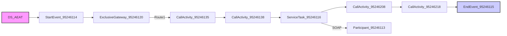

markdown
**iFlowId**: EMCS_AEAT_-_REPSOL - **iFlowVersion**: 1.0.6

**Mermaid Diagram**
- **Visual representation of the flow**

```mermaid
graph LR
    BC_SENDER --> SOAP[StartEvent_2]
    StartEvent_2 --> ExtractData[CallActivity_20]
    ExtractData --> ExtractPayload[CallActivity_95246099]
    ExtractPayload --> CH_STEP[CallActivity_95246175]
    CH_STEP --> Base64Encode[CallActivity_95246103]
    Base64Encode --> PrepareBody[CallActivity_80508921]
    PrepareBody --> LogRequest[CallActivity_95245819]
    LogRequest --> ProcessDirect[ServiceTask_7]
    ProcessDirect --> LogResponse[CallActivity_95245816]
    LogResponse --> CreateStructure[CallActivity_95246166]
    CreateStructure --> SaveToDocumentum[CallActivity_95246172]
    SaveToDocumentum --> SaveHeader[CallActivity_95245924]
    SaveHeader --> Base64Decoder[CallActivity_95246105]
    Base64Decoder --> Router[ExclusiveGateway_95246140]
    Router -- Route1 --> DSAEAT[CallActivity_95246108]
    DSAEAT --> EndEvent[EndEvent_95246157]
    Router -- Route2 --> ConvertHeaders[CallActivity_95246143]
    ConvertHeaders --> DeleteHeaders[CallActivity_95246144]
    DeleteHeaders --> RequestReply2[ServiceTask_95246145]
    RequestReply2 --> ExtractRoot[CallActivity_95246212]
    ExtractRoot --> GenerateResponse[CallActivity_95246214]
    GenerateResponse --> EndEvent

    style BC_SENDER fill:#f9f,stroke:#333,stroke-width:2px
    style EndEvent fill:#ccf,stroke:#333,stroke-width:2px

    FIRMA_SIAVAL[Participant_2]
    ProcessDirect -- ProcessDirect --> FIRMA_SIAVAL
```

```mermaid
graph LR
    DS_FIRMA --> StartEvent_80508888
    StartEvent_80508888 --> Router3[ExclusiveGateway_80508899]
    Router3 -- Process --> MaintainHeaders[CallActivity_80508900]
    MaintainHeaders --> LogRequest2[CallActivity_95246198]
    LogRequest2 --> SetCustomHeaders[CallActivity_80508927]
    SetCustomHeaders --> Base64Encoder1[CallActivity_95246180]
    Base64Encoder1 --> PayloadToJX0[CallActivity_95246177]
    PayloadToJX0 --> RequestReply3[ServiceTask_95246189]
    RequestReply3 --> LogResponse3[CallActivity_95245822]
    LogResponse3 --> EndEvent_95246193

    DOCUMENTUM[Participant_80508889]
    RequestReply3 -- SOAP --> DOCUMENTUM

    style DS_FIRMA fill:#f9f,stroke:#333,stroke-width:2px
    style EndEvent_95246193 fill:#ccf,stroke:#333,stroke-width:2px
```

**BPMN Diagram**

**Functional Summary**
- **Brief description of the iFlow**
This iFlow processes documents, signs them, and sends them to AEAT (Spanish Tax Agency) and Documentum. It includes exception handling and logging mechanisms. The flow involves extracting data, transforming messages, and interacting with external systems via SOAP and ProcessDirect adapters. Retries are managed using DataStore.

- **Involved systems with Adapters Type and Endpoint Type**
    - BC_SENDER: SOAP, HTTP (Sender)
    - DS_FIRMA: DataStoreConsumer, JDBC (Sender)
    - DS_AEAT: DataStoreConsumer, JDBC (Sender)
    - FIRMA_SIAVAL: ProcessDirect, Not Applicable (Receiver)
    - AlertReceiver: ProcessDirect, Not Applicable (Receiver)
    - DOCUMENTUM: SOAP, HTTP (Receiver)
    - AEAT: SOAP, HTTP (Receiver)
    - AEAT_Actual: SOAP, HTTP (Receiver)

- **Key steps**
    1. Receives a document from BC_SENDER via SOAP.
    2. Extracts data and parameters from the document.
    3. Signs the document using FIRMA_SIAVAL via ProcessDirect.
    4. Encodes the signed document in Base64.
    5. Creates a structure to send the document to Documentum.
    6. Saves the document to the DataStore DS_AEAT and ReqSignedToDocumentum
    7. Sends the document to DOCUMENTUM via SOAP.
    8. Sends the signed document to AEAT via SOAP or ProcessDirect.
    9. Handles exceptions and sends notifications if necessary.

- **Message transformation**
    - "Prepare body to SIA" Enricher step transform the message to `<ns:DocumentSignModuleRequest>`
    - Payload to JX0 Enricher step transform the message to `<ns1:insertarDocumento xmlns:ns1="http://repsol.com/pi/emcs/ejb/tipos/">`
    - Create Structure to Send Documentum Enricher step transform the message to `<p:documentoAEAT xmlns:p="http://repsol.com/emcs/documentoAeat">`
    - Generate Response Body - Copy and Generate Response Body enrichers transform the message to `<emis:respuesta xmlns:emis="http://repsol.com/emcs/intracomunitario/emisionBorradorV32">`
    - The iFlow also perform Base64 encode / decode operations.

- **Externalized parameters list, configured values (read from parameters.prop) and their descriptions**
    - data_firma: ZFACTURAE_FRM_FIRMADO (Description not found)
    - PD_Documentum: /modules/documentManager/documentum/documents/archiveSAP (Description not found)
    - PathDocumentum: /D.E.Marketing Europa/Facturas/Sin Procesar (Description not found)
    - SENDER_AUTH: RoleBased (Description not found)
    - SENDER_BC: Sender (Description not found)
    - LocationID: SCC_INT_SUITE_AWS_EU (Description not found)
    - TimeoutUK2: 120000 (Description not found)
    - DS_NAME: ZFACTURAE_FRM (Description not found)
    - UserDocumentum: SVC_TSAPFACGLP@rg.repsol.com (Description not found)
    - HostUX2: http\://portaluk2.rg.repsol.com\:2543/sap/bc/srt/Idoc (Description not found)
    - RepositorioDocumentum: reptestdocum (Description not found)
    - DS_FTP: DS_FTP (Description not found)
    - Sender_Endpoint: /AEAT/EMCS (Description not found)
    - FacType: do_fac_glfdeac (Description not found)
    - DS_MAIL_ZFACTURAE_FRM: DS_MAIL_ZFACTURAE_FRM (Description not found)
    - BAPIRET: BAPIRET2 (Description not found)
    - PrivateKeyLoginAeat: \${property.NIF} (Description not found)
    - SENDER_ENDPOINT: /ZFACTURAE (Description not found)
    - ELK_AUTH: ELK_LOGGER (Description not found)
    - Logging: true (Description not found)
    - ELK_LOCATION_ID:  (Description not found)
    - AEAT_ADDRESS: https\://prewww1.aeat.es/wlpl/inwinvoc/es.aeat.dit.adu.adi1.emcssw.Ie815V32SOAP (Description not found)
    - MAX_RETRIES: 2 (Description not found)
    - DS_Bapiret2: DS_Bapiret2 (Description not found)
    - DS_AEAT: DS_AEAT (Description not found)
    - Credential_UX2: SAP UK2 (Description not found)
    - ELK_ENDPOINT: https\://ingestaelastic.repsol.com\:9200/logs_isuite_poc/_doc (Description not found)
    - SMTP: smtp.repsol.com\:25 (Description not found)
    - Email_Notification: true (Description not found)
    - SAP_MessageType: CD815A (Description not found)
    - AuthJX0: AuthJX0 (Description not found)
    - ReqSignedToDocumentum: ReqSignedToDocumentum (Description not found)
    - DS_Mail_Notif: DS_Mail_Notif (Description not found)
    - DocumentumJX0: http\://portaljk0.rg.repsol.com\:443/ActualizacionBandejaService/EMCSInternoActualizacionBandeja (Description not found)
    - TimeoutMail: 30000 (Description not found)
    - ELK_PROXY_TYPE: Internet (Description not found)

- **DataStore / JMS Dependency**
Yes

- **Cloud Connector Dependency**
Yes

- **Common Scripts Dependency**
    - Common_-_Groovy_Logging_Scripts (scriptBundleId)
        - Log_XML_Request.groovy (script)
        - Log_XML_Response.groovy (script)
        - Log_Discarded_Message.groovy (script)
        - Log_Exception.groovy (script)

- **ProcessDirect ComponentType Dependency**
    - /modules/Signature/SignDoc
    - /common/snowIncident