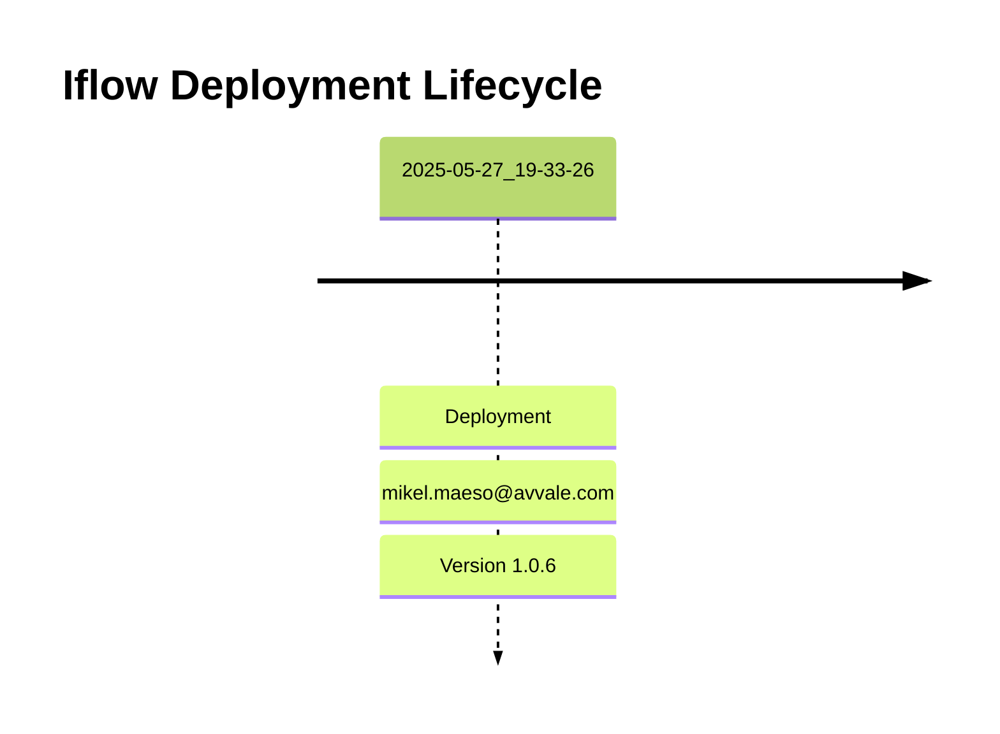

# Integration Flow: EMCS_AEAT_-_REPSOL

This document provides an overview, deployment history, and links to specific versions for the integration flow `EMCS_AEAT_-_REPSOL`.

## Deployment History
<!-- DEPLOYMENT_TIMELINE_START -->

<!-- DEPLOYMENT_TIMELINE_END -->

## Available Versions
<!-- VERSION_LINKS_START -->
- [Version 1.0.6 (Deployed: 2025-05-27 19:33:26 CEST CEST)](./1.0.6/readme.md)
<!-- VERSION_LINKS_END -->