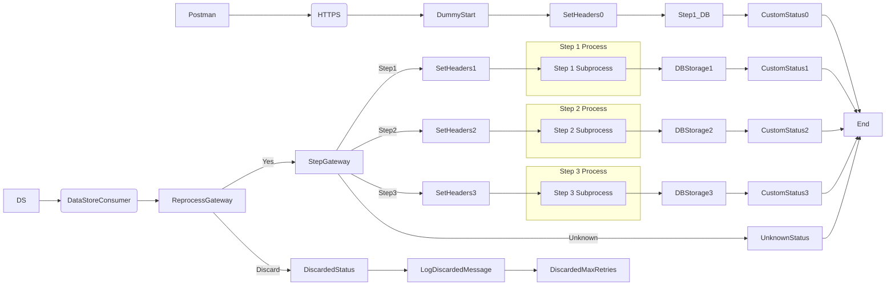

markdown
**iFlowId:** SEDA_Model_-_Single_DS_-_Restart_and_Discard_-_REPSOL - **iFlowVersion:** 1.0.1

**Mermaid Diagram**

**BPMN Diagram**

**Functional Summary**
- **Brief description of the iFlow**
This iFlow demonstrates a SEDA (Staged Event-Driven Architecture) model using a Data Store. It retrieves messages from a Data Store, processes them through multiple steps, and includes error handling and message discarding based on retry attempts.

- **Involved systems with Adapters Type and Endpoint Type**
    - Postman - HTTPS (Sender)
    - DS - DataStoreConsumer (Sender) - JDBC

- **Key steps**
 1. Receive message from HTTPS endpoint.
 2. Store the message in Data Store (Step1).
 3. Retrieve message from Data Store.
 4. Route the message based on the 'Step' header.
 5. Execute Step 1, Step 2, and Step 3 processes sequentially.
 6. If a step fails, log the exception and retry.
 7. If the maximum number of retries is exceeded, discard the message and log it.
 8. Update the message processing log with custom statuses at various stages.

- **Message transformation**
    - Set Headers in "Dummy Start" Process: Sets SAP_Sender, SAP_Receiver, SAP_MessageType, and Step headers.
    - Prepare Step 2 and Step 3: The "Prepare Step" processes create message envelopes with base64 encoded messages.
    - Custom Status updates using expressions and constants to set SAP_MessageProcessingLogCustomStatus

- **Externalized parameters list, configured values and their descriptions**
    - Data Store Name: SEDA_MODEL_MMZ - Name of the Data Store to use.
    - Expiration Period: 7 - Expiration period for the Data Store entries (in days).
    - Lock Timeout: 10 - Lock timeout for Data Store access (in seconds).
    - MaxRetries: 3 - Maximum number of retries for processing a message.
    - Number of Concurrent Processes: 1 - Number of concurrent processes.
    - Poll Interval: 10 - Interval for polling the Data Store (in seconds).
    - Retention Threshold 4 Alerting: 1 - Threshold for alerting on data retention.
    - Retry Interval: 15 - Interval between retry attempts (in seconds).
    - RoleName: ESBMessaging.send - Role for sender authentication.
    - SEDA_MAIN_QUEUE: SEDA_MODEL_MMZ - SEDA queue name.
    - Exponential Backoff: 1 - Boolean value to enable exponential backoff
    - Maximum Retry Interval: 1440 - Maximum retry interval in minutes

- **DataStore / JMS Dependency**
Yes

- **Cloud Connector Dependency**
Not Found

- **Common Scripts Dependency**
    - Log Async Exception: Groovy_Logging_Scripts (scriptBundleId) / Log_Exception_Async.groovy (script)
    - Log Discarded Message: Groovy_Logging_Scripts (scriptBundleId) / Log_Discarded_Message.groovy (script)

- **ProcessDirect ComponentType Dependency**
Not Found