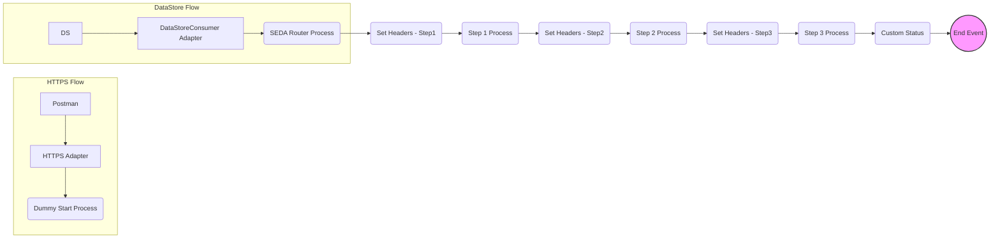

iFlowId: SEDA_Model_-_Single_DS_-_Restart_and_Discard_-_REPSOL - iFlowVersion:1.0.1

**Mermaid Diagram**

**BPMN Diagram**

**Functional Summary**
- **Brief description of the iFlow**
This iFlow demonstrates a SEDA (Staged Event-Driven Architecture) model with a single DataStore for message persistence, restart, and discard capabilities. It receives messages via HTTPS or DataStore, processes them through a series of steps (Step 1, Step 2, Step 3), and stores the messages in a DataStore. The iFlow handles exceptions and provides logging. It also implements a retry mechanism with a maximum retry count.

- **Involved systems with Adapters Type and Endpoint Type**
    - Postman - HTTPS - EndpointSender
    - DS - DataStoreConsumer - EndpointSender

- **Key steps**
    1. Receive message from HTTPS endpoint or DataStore.
    2. Store message in DataStore (Step1 process).
    3. Retrieve message from DataStore and process (Step 2 process).
    4. Store message in DataStore (Step2 process).
    5. Retrieve message from DataStore and process (Step 3 process).
    6. Store message in DataStore (Step3 process).
    7. Set message processing log status.
    8. Determine next step based on header information.
    9. Discard the message if maximum retries exceeded.

- **Message transformation**
The iFlow uses Enrichers to set headers and custom status messages throughout the process. The "Prepare Step" activities (e.g., "Prepare Step 2") also transform the message by wrapping content in an Envelope. Groovy scripts are used for logging.

- **Externalized parameters list, configured values and their descriptions**
    - Data Store Name: SEDA_MODEL_MMZ - Specifies the name of the DataStore to be used.
    - Expiration Period: 7 - Specifies the message expiration period in days.
    - Lock Timeout: 10 - Specifies the timeout for DataStore lock.
    - MaxRetries: 3 - Specifies the maximum number of retries for DataStore operations.
    - Maximum Retry Interval: 1440 - Specifies the maximum retry interval in minutes.
    - Number of Concurrent Processes: 1 - Specifies the number of concurrent processes.
    - Poll Interval: 10 - Specifies the poll interval for DataStore consumer in seconds.
    - Retention Threshold 4 Alerting: 1 - Specifies the retention threshold for alerting.
    - Retry Interval: 15 - Specifies the retry interval in seconds.
    - RoleName: ESBMessaging.send - Specifies the role name for authentication.
    - SEDA_MAIN_QUEUE: SEDA_MODEL_MMZ - Specifies the SEDA main queue name.
    - Exponential Backoff: 1 - Enables exponential backoff for retries.

- **DataStore / JMS Dependency**
Yes

- **Cloud Connector Dependency**
Not Found

- **Common Scripts Dependency**
    - Groovy_Logging_Scripts - Log_Discarded_Message.groovy
    - Groovy_Logging_Scripts - Log_Exception_Async.groovy

- **ProcessDirect ComponentType Dependency**
Not Found