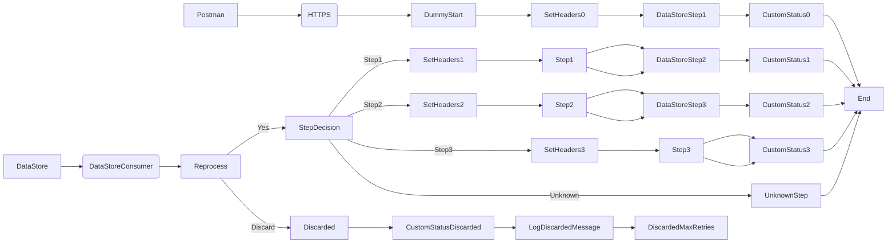

markdown
**iFlowId**: SEDA_Model_-_Single_DS_-_Restart_and_Discard_-_REPSOL - **iFlowVersion**: 1.0.2

**Mermaid Diagram**

**BPMN Diagram**

**Functional Summary**
- **Brief description of the iFlow**
  This iFlow processes messages asynchronously using a DataStore and SEDA (Staged Event-Driven Architecture) router. It retrieves messages from a DataStore, processes them through a series of steps, and stores intermediate results back into the DataStore. The iFlow includes error handling and retry mechanisms, discarding messages that exceed the maximum retry limit. It also creates a custom status in the message processing log for each step.

- **Involved systems with Adapters Type and Endpoint Type**
    - Postman (HTTPS Sender)
    - DS (DataStoreConsumer Sender)

- **Key steps**
    1.  Receive message from HTTPS endpoint.
    2.  Store message into DataStore (Step1).
    3.  Retrieve message from DataStore.
    4.  Route message based on the "Step" header (Step1, Step2, Step3).
    5.  Process message based on "Step" header, calling Integration Processes (Step 1, Step 2, Step 3)
    6.  Store message into DataStore for each step (Step2, Step3).
    7.  If an error occurs in any step, log the exception asynchronously.
    8.  Discard messages that exceed the maximum retry limit.

- **Message transformation**
    - Enricher components are used to set headers (SAP_Sender, SAP_Receiver, SAP_MessageType, Step)
    - Custom status messages are created using expressions based on headers.
    - Exception logging with custom script `Log_Exception_Async.groovy`.
    - Discarded message logging with custom script `Log_Discarded_Message.groovy`.

- **Externalized parameters list, configured values and their descriptions**
    - MaxRetries: 3 - Maximum number of retries before discarding a message.
    - SEDA_MAIN_QUEUE: SEDA_MODEL_MMZ - JMS Queue Name. (Not actually used in the current iFlow)
    - Retention Threshold 4 Alerting: 1 - Retention threshold for alerting.
    - Retry Interval: 15 - Retry interval in seconds.
    - Number of Concurrent Processes: 1 - Number of concurrent processes. (Not actually used in the current iFlow)
    - Data Store Name: SEDA_MODEL_MMZ - Name of the DataStore.
    - RoleName: ESBMessaging.send - Role name for authorization.
    - Exponential Backoff: 1 - Flag to enable exponential backoff for retries.
    - Expiration Period: 7 - Expiration period in days.
    - Lock Timeout: 10 - Lock timeout in seconds.
    - Maximum Retry Interval: 1440 - Maximum retry interval in minutes.
    - Poll Interval: 10 - Poll interval in seconds for retrieving messages from DataStore.

- **DataStore / JMS Dependency**
    Yes

- **Cloud Connector Dependency**
    Not Found

- **Common Scripts Dependency**
    - Log_Discarded_Message.groovy - scriptBundleId: Groovy_Logging_Scripts
    - Log_Exception_Async.groovy - scriptBundleId: Groovy_Logging_Scripts

- **ProcessDirect ComponentType Dependency**
    Not Found