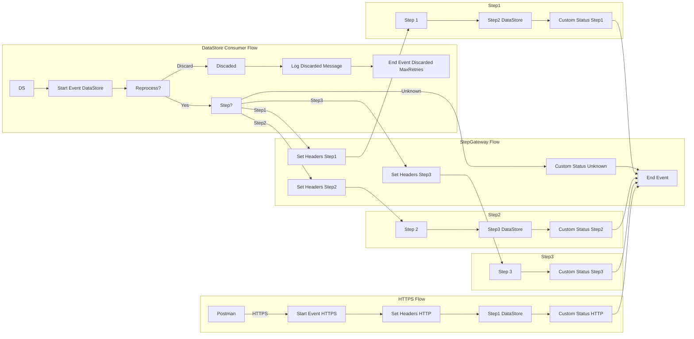

markdown
**iFlowId**: SEDA_Model_-_Single_DS_-_Restart_and_Discard_-_REPSOL - **iFlowVersion**: 1.0.2

**Mermaid Diagram**

**BPMN Diagram**

**Functional Summary**
- **Brief description of the iFlow**
  This iFlow processes messages asynchronously using a SEDA (Staged Event-Driven Architecture) router and stores them in a Data Store. It includes error handling with retry and discard mechanisms based on the number of retries.  The iFlow starts either by an HTTPS call or by a Data Store Consumer.

- **Involved systems with Adapters Type and Endpoint Type**
    - Postman (HTTPS, Sender)
    - DS (DataStoreConsumer, Sender)

- **Key steps**
    1. Receives messages via HTTPS or DataStore Consumer.
    2. Checks if the maximum number of retries has been exceeded. If yes, discards the message.
    3. Routes the message through three steps: Step 1, Step 2, and Step 3.
    4. Each step enriches the message with specific headers.
    5. Each step stores the message into DataStore using a key that contains the RunId.
    6. Logs Async Exception in case of errors.

- **Message transformation**
    - Enricher: Used in several steps to set headers (SAP_Sender, SAP_Receiver, SAP_MessageType) and custom status (SAP_MessageProcessingLogCustomStatus).

- **Externalized parameters list, configured values and their descriptions**
    - `MaxRetries`: 3 - The maximum number of retries before discarding a message.
    - `SEDA_MAIN_QUEUE`: SEDA_MODEL_MMZ - The name of the JMS queue used for SEDA. (Not in use)
    - `Retention Threshold 4 Alerting`: 1 - Retention threshold for alerting.
    - `Retry Interval`: 15 - The interval between retry attempts in seconds.
    - `Number of Concurrent Processes`: 1 - The number of concurrent processes. (Not in use)
    - `Data Store Name`: SEDA_MODEL_MMZ - The name of the Data Store used for storing messages.
    - `RoleName`: ESBMessaging.send - The role required for sending messages via HTTPS.
    - `Exponential Backoff`: 1 - Indicates whether exponential backoff is enabled for retry attempts.
    - `Expiration Period`: 7 - The expiration period for messages in days.
    - `Lock Timeout`: 10 - Timeout to obtain file lock.
    - `Maximum Retry Interval`: 1440 - Maximum retry interval in minutes.
    - `Poll Interval`: 10 - Poll Interval in seconds.

- **DataStore / JMS Dependency**
    Yes

- **Cloud Connector Dependency**
    Not Found

- **Common Scripts Dependency**
    - Groovy_Logging_Scripts:
        - Log_Discarded_Message.groovy
        - Log_Exception_Async.groovy

- **ProcessDirect ComponentType Dependency**
    Not Found