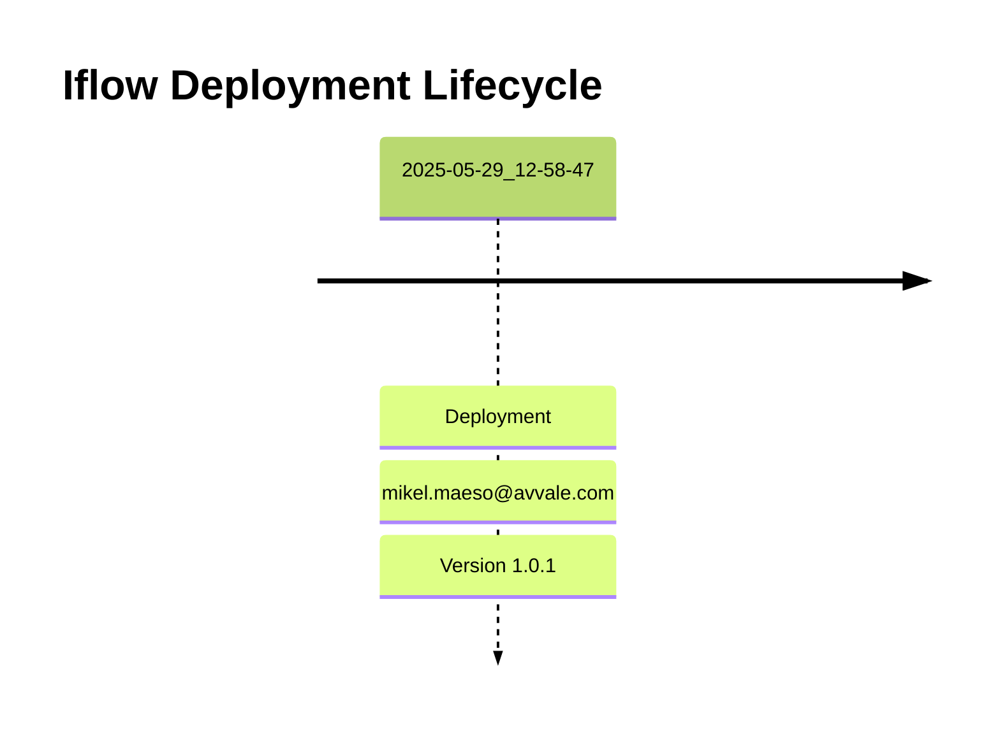

# Integration Flow: SEDA_Model_-_Single_DS_-_Restart_and_Discard_-_REPSOL

This document provides an overview, deployment history, and links to specific versions for the integration flow `SEDA_Model_-_Single_DS_-_Restart_and_Discard_-_REPSOL`.

## Deployment History
<!-- DEPLOYMENT_TIMELINE_START -->

<!-- DEPLOYMENT_TIMELINE_END -->

## Available Versions
<!-- VERSION_LINKS_START -->
- [Version 1.0.1 (Deployed: 2025-05-29 12:58:47 CEST CEST)](./1.0.1/readme.md)
<!-- VERSION_LINKS_END -->