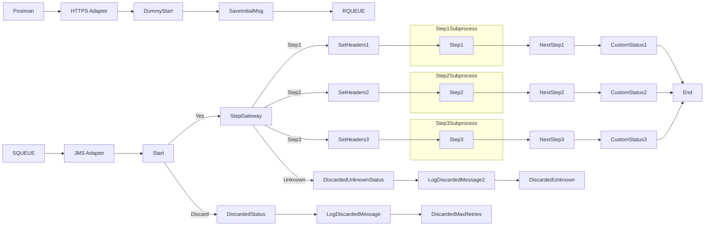

markdown
**iFlowId**: SEDA_Model_-_Single_Queue_-_Restart_and_Discard_-_REPSOL - **iFlowVersion**: 1.0.1

**Mermaid Diagram**

**BPMN Diagram**

**Functional Summary**
- **Brief description of the iFlow**
  This iFlow implements a SEDA (Staged Event-Driven Architecture) pattern with a single queue for asynchronous message processing. It includes restart and discard mechanisms based on retry counts. The flow receives messages, processes them through multiple steps, and handles exceptions, logging details for monitoring.

- **Involved systems with Adapters Type and Endpoint Type**
    - SQUEUE: JMS Adapter (EndpointSender)
    - RQUEUE: JMS Adapter (EndpointRecevier)
    - Postman: HTTPS Adapter (EndpointSender)

- **Key steps**
    1.  Receive a message via JMS or HTTPS.
    2.  Route the message through a sequence of processing steps (Step 1, Step 2, Step 3).
    3.  Log exceptions that occur during processing.
    4.  If processing fails and the retry limit is exceeded, discard the message.
    5.  Log discarded messages.

- **Message transformation**
    - Enrichment of message headers at multiple stages (Set Headers activities).
    - Enricher calls add custom status to SAP message processing log (Custom Status activities)
    - Add/delete properties to body payload (Prepare Step activities).

- **Externalized parameters list, configured values and their descriptions**
    - `MaxRetries`: 10 - Maximum number of retries before discarding a message.
    - `SEDA_MAIN_QUEUE`: SEDA_MODEL_MMZ - Name of the main JMS queue used for message processing.
    - `Expiration Period`: 7 - Expiration period (likely in days, but units not explicitly defined).
    - `Maximum Retry Interval`: 1440 - Maximum interval between retries (units not explicitly defined).
    - `Retention Threshold 4 Alerting`: 1 - Threshold for alerting on message retention (units not explicitly defined).
    - `Retry Interval`: 15 - Interval between retries (units not explicitly defined).
    - `Number of Concurrent Processes`: 1 - Number of concurrent processes for the JMS receiver.

- **DataStore / JMS Dependency**
    Yes

- **Cloud Connector Dependency**
    Not Found

- **Common Scripts Dependency**
    - Log_Discarded_Message.groovy - Groovy_Logging_Scripts
    - Log_Exception_Async.groovy - Groovy_Logging_Scripts

- **ProcessDirect ComponentType Dependency**
    Not Found