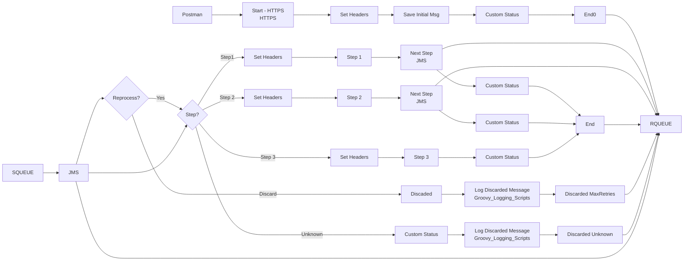

**iFlowId**: SEDA_Model_-_Single_Queue_-_Restart_and_Discard_-_REPSOL - **iFlowVersion**: 1.0.1

**Mermaid Diagram**

**BPMN Diagram**

**Functional Summary**
- **Brief description of the iFlow**
  This iFlow demonstrates a SEDA (Staged Event-Driven Architecture) pattern with a single queue, including restart and discard capabilities. Messages are processed through multiple steps, and exceptions are handled asynchronously. Messages exceeding the maximum retry count are discarded.

- **Involved systems with Adapters Type and Endpoint Type**
  - SQUEUE: JMS (EndpointSender)
  - RQUEUE: JMS (EndpointRecevier)
  - Postman: HTTPS (EndpointSender)

- **Key steps**
  1.  Receive message via HTTPS or JMS.
  2.  Set initial headers and save the message for asynchronous processing in "Dummy Start" process.
  3.  The "SEDA Router" process receives messages from the main queue.
  4.  The Router determines the next step based on the 'Step' property of the message.
  5.  Each step ("Step 1", "Step 2", "Step 3") calls a local integration process, setting headers and custom statuses.
  6.  After each step, the message is sent to the main queue for the next step.
  7.  Exceptions during processing are caught and logged asynchronously.
  8.  Messages exceeding the `MaxRetries` limit are discarded.
  9.  If the Step is Unknown, the message will be discarded.

- **Message transformation**
  - The iFlow uses enrichers to set message headers and custom status logs.
  - Groovy scripts are used for logging discarded messages and handling exceptions.
  - Each Step has its own process to prepare the message (prepare step 2, prepare step 3).

- **Externalized parameters list, configured values and their descriptions**
  - `MaxRetries`: 10 (Maximum number of retries before discarding the message)
  - `SEDA_MAIN_QUEUE`: SEDA_MODEL_MMZ (Name of the main JMS queue)
  - `Expiration Period`: 7 (Message expiration period)
  - `Maximum Retry Interval`: 1440 (Maximum retry interval in minutes)
  - `Retention Threshold 4 Alerting`: 1 (Retention threshold for alerting)
  - `Retry Interval`: 15 (Retry interval in minutes)
  - `Number of Concurrent Processes`: 1 (Number of concurrent processes for JMS adapter)

- **DataStore / JMS Dependency**
  Yes

- **Cloud Connector Dependency**
  Not Found

- **Common Scripts Dependency**
  - `Groovy_Logging_Scripts`:
    - `Log_Discarded_Message.groovy`
    - `Log_Exception_Async.groovy`

- **ProcessDirect ComponentType Dependency**
  Not Found