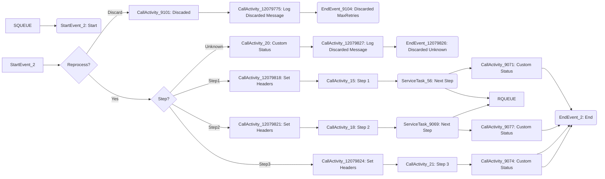

**iFlowId**: SEDA_Model_-_Single_Queue_-_Restart_and_Discard_-_REPSOL - **iFlowVersion**: 1.0.2

**Mermaid Diagram**

**BPMN Diagram**

**Functional Summary**
- **Brief description of the iFlow**
  This iFlow implements a SEDA (Staged Event-Driven Architecture) model using a single JMS queue. It demonstrates message processing across multiple steps (Step 1, Step 2, Step 3) with restart and discard mechanisms based on the number of retries. It includes exception handling and logging.

- **Involved systems with Adapters Type and Endpoint Type**
  - SQUEUE: JMS (EndpointSender)
  - RQUEUE: JMS (EndpointRecevier)
  - Postman: HTTPS (EndpointSender)

- **Key steps**
  1.  Receive a message via JMS from SQUEUE.
  2.  Check retry count and discard based on 'MaxRetries' threshold.
  3.  Route the message to different processing steps (Step 1, Step 2, Step 3) based on the `Step` property. Each step sets headers and custom statuses for logging.
  4.  Each step can optionally throw an exception, handled by a dedicated exception subprocess.
  5. Send messages to RQUEUE after each processing step.
  6.  If the `Step` property is not recognized, the message is discarded.

- **Message transformation**
  - Enrichers are used to set headers (SAP_Sender, SAP_Receiver, SAP_MessageType) and custom statuses (SAP_MessageProcessingLogCustomStatus).
  - Content modifiers are used within each step to prepare messages.
  - Groovy scripts are used for logging exceptions and discarding messages.

- **Externalized parameters list, configured values and their descriptions**
  - `MaxRetries`: 10 - Maximum number of retries before discarding a message.
  - `SEDA_MAIN_QUEUE`: SEDA_MODEL_MMZ - Name of the main JMS queue.
  - `Expiration Period`: 7 - Expiration period for messages.
  - `Maximum Retry Interval`: 1440 - Maximum interval between retries (in minutes).
  - `Retention Threshold 4 Alerting`: 1 - Retention threshold for alerting.
  - `Retry Interval`: 15 - Interval between retries (in minutes).
  - `Number of Concurrent Processes`: 1 - Number of concurrent processes.

- **DataStore / JMS Dependency**
  Yes

- **Cloud Connector Dependency**
  Not Found

- **Common Scripts Dependency**
  - Groovy_Logging_Scripts: Log_Discarded_Message.groovy
  - Groovy_Logging_Scripts: Log_Exception_Async.groovy

- **ProcessDirect ComponentType Dependency**
  Not Found