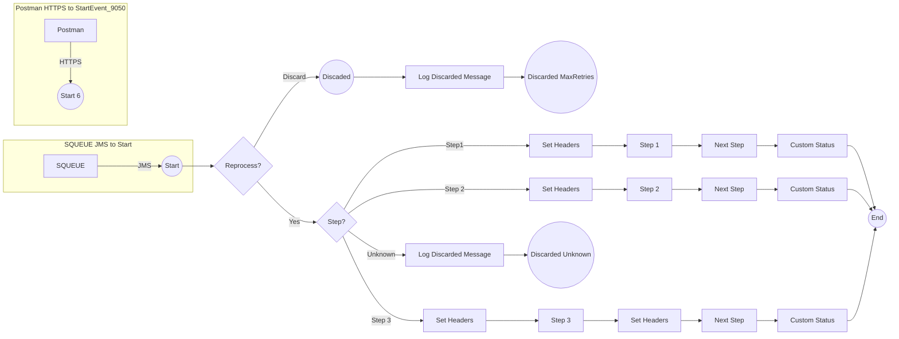

**iFlowId**: SEDA_Model_-_Single_Queue_-_Restart_and_Discard_-_REPSOL - **iFlowVersion**: 1.0.2

**Mermaid Diagram**

**BPMN Diagram**

**Functional Summary**
- **Brief description of the iFlow**
This iFlow implements a SEDA (Staged Event-Driven Architecture) model with a single queue, restart, and discard mechanism. Messages are processed through multiple steps, and exceptions are handled with asynchronous logging. Messages can be reprocessed up to a maximum number of retries, after which they are discarded. Messages with unknown `Step` property are discarded as well.

- **Involved systems with Adapters Type and Endpoint Type**
    - SQUEUE (JMS, EndpointSender)
    - Postman (HTTPS, EndpointSender)
    - RQUEUE (JMS, EndpointRecevier)

- **Key steps**
    1. Receives messages from SQUEUE via JMS or Postman via HTTPS.
    2. Routes the message based on the `Step` property.
    3. Processes the message through steps (Step 1, Step 2, Step 3).
    4. If a step fails, logs the exception asynchronously.
    5. If the message exceeds the maximum retries, discards the message.

- **Message transformation**
    - Enrichment of message headers with step information (sender, receiver, message type).
    - Creation of custom message processing log statuses.
    - Preparation steps that includes creating/deleting properties and setting the message body.

- **Externalized parameters list, configured values and their descriptions**
    - `MaxRetries`: 10 - Maximum number of retries before discarding the message.
    - `SEDA_MAIN_QUEUE`: SEDA_MODEL_MMZ - The name of the JMS queue used for message processing.
    - `Expiration Period`: 7 - Expiration period for messages.
    - `Maximum Retry Interval`: 1440 - Maximum retry interval in minutes.
    - `Retention Threshold 4 Alerting`: 1 - Retention threshold for alerting.
    - `Retry Interval`: 15 - Retry interval in minutes.
    - `Number of Concurrent Processes`: 1 - Number of concurrent processes for the JMS adapter.

- **DataStore / JMS Dependency**
Yes

- **Cloud Connector Dependency**
Not Found

- **Common Scripts Dependency**
    - Log_Discarded_Message.groovy (Groovy_Logging_Scripts)
    - Log_Exception_Async.groovy (Groovy_Logging_Scripts)

- **ProcessDirect ComponentType Dependency**
Not Found