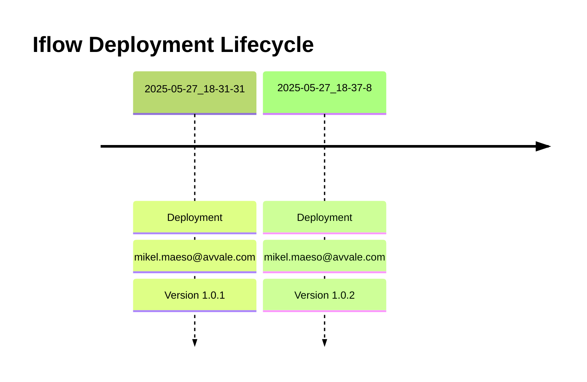

# Integration Flow: SEDA_Model_-_Single_Queue_-_Restart_and_Discard_-_REPSOL

This document provides an overview, deployment history, and links to specific versions for the integration flow `SEDA_Model_-_Single_Queue_-_Restart_and_Discard_-_REPSOL`.

## Deployment History
<!-- DEPLOYMENT_TIMELINE_START -->

<!-- DEPLOYMENT_TIMELINE_END -->

## Available Versions
<!-- VERSION_LINKS_START -->
- [Version 1.0.2 (Deployed: 2025-05-27 18:37:08 CEST CEST)](./1.0.2/readme.md)
- [Version 1.0.1 (Deployed: 2025-05-27 18:31:31 CEST CEST)](./1.0.1/readme.md)
<!-- VERSION_LINKS_END -->